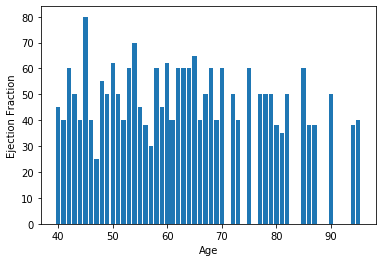
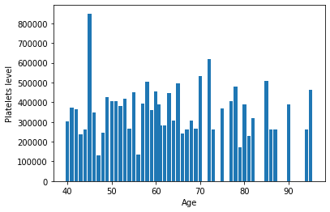
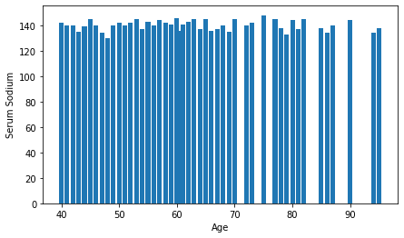
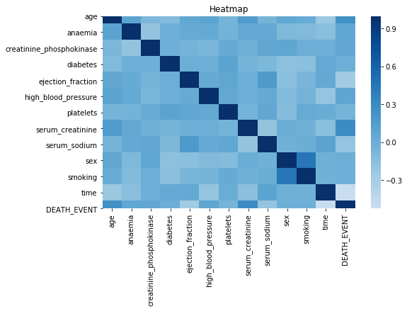
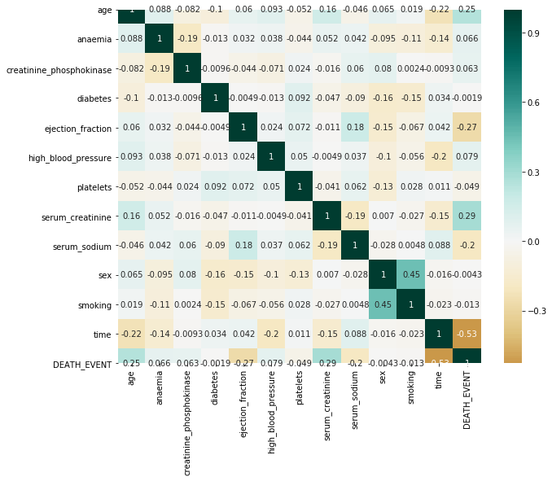

## What is Data Visualization?

It is a technique of representing the data in the forms of graphics so that it can easily be interpreted.
As a human, we all know that we are good at understanding graphics rather than understanding thousands of line of statistics.

Today no matter which field you are working on, *Data Visualization* is very important in analzing the **raw data** to identify **trends, patterns**, and **outliers** within large data sets. 

**Data Visualization** is used mainly in the field of **Machine Learning and Data Science**.
Data visualization helps the data scientist explore the data, understand the data and process the data to set it up for modeling.

Since the machine learning process is iterative, asking relevant questions to kick off the process will involve putting data into context.

Putting data into context means that you will visualize all the columns within the data to understand the following:
* The meaning of each column of data.
* Whether it’s a categorical or continuous variable for each column.
* Whether the data is an independent or dependent variable.

Using the dataset of [***Heart attack possibility***](https://github.com/Avikr76/Open-contributions/blob/master/extras/heart_failure_clinical_records_dataset.csv), below is an example of visualizing some column of our dataset
 

### Where are the possible data errors, such as missing data, wrong data types, misleading data, and outlier data, and so on?

Missing data is a well-recognized problem in large datasets. This lack of standardization is one of the leading causes of the subtle problem of disguised missing data, in which unknown, inapplicable, or otherwise nonspecified responses are encoded as valid data values. The consequences of disguised missing data can be quite serious. Bad data results in bad results.
The data must be cleaned before using it in training model to correct and identify all the errors. So we get correct results.

Below is an example of a nullity matrix that gives you missing data information visually on columns of data:

***The high density represents the high data errors like misleading data, missing data etc.***
It is visualized by the Python's **Heatmap**.It gives the degree of missing data.

###	Where are the imbalances of data?
Below is an example of using a heatmap to represent the correlation of the relationships between the variables.
Hatmap is just  a grid of divided into small squares which has a different shades of color for easier interpretation of data.
The larger the number and darker the color the higher the correlation between the two variables and vice versa.

### Data visualization can power model creation and model tuning

With the advancement of data visualization techniques, model creation and model tuning do not have to be abstract processes means  Instead of dealing with the details of implementing algorithms, or figuring out proper ways to hitch the output of one function to the input of another, the developer can focus on the overall logic of the application with the help of **TensorFlow** . 
**TensorFlow** allows you to follow the model-creation process with data visualization.
### Conclusions
Visualization of daya is very important in todays world. With different tools in python such as **seaborn, scikit-learn, and matplotlib**, helps in visualizing data easily and efficiently.

## **Abhinav Kumar**
 
      

