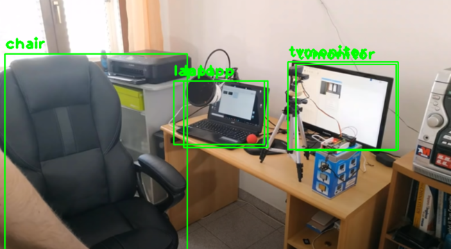

# YoloV3 Algorithm
- YOLO(You Only Live Once) is an **Oject Detection Algorithm**
- A single neural network is applied to the full image. This network divides the image into regions and predicts **bounding boxes** and probabilities for each region. These bounding boxes are weighted by the predicted probabilities.
- High **Accuracy** and extremely **Fast**


## How to work on YoloV3:
You need to download these files:
- [yolov3.cfg](https://github.com/pjreddie/darknet/blob/master/cfg/yolov3.cfg) -> model configuration file
- [yolo.weights](https://pjreddie.com/media/files/yolov3.weights) -> pretrained model 
- [Object names](https://github.com/pjreddie/darknet/blob/master/data/coco.names) list of objects the model can detect

## Lets create a simple program to detect humans in the video
I consider you have a good understanding OpenCV like loading video and saving in a codec format or displaying shapes and text on a frame.

Lets see these code segments where you might get stuck
```py
net = cv2.dnn.readNet('yolov3.weights', 'yolov3.cfg')
layer_names = net.getLayerNames()
output_layer = []
for i in net.getUnconnectedOutLayers():
    output_layer.append(layer_names[i[0] - 1])
```
Here the yolov3 is loaded with the help of yolov3.weights and yolov3.cfg files and as we are concern with the outputs, we store the final or output layer of the architecture.

```py
blob = cv2.dnn.blobFromImage(frame, 0.005, (416, 416), (0, 0, 0), True)
```
This line is used to resize the image to 416x416 for the model to process and also this function normalize the image and change the channel orders.
```py
blobFromImage(img, scalefactor, size, mean, swapRB, crop)
```
Here size can be:
- 320 for fast process but less accurate
- 609 for slow process but high accurate
- 320 for moderate process and moderate accurate
swapRB is used to swap red and blue channels in the image.

```py
net.setInput(blob)
outs = net.forward(output_layer)
```
Provide the blob to the network and after processing store the images detection in outs variable.

```py
boxes, class_ids, confidences = [], [], []
for out in outs:
    for detection in out:
        scores = detection[5:]
        class_id = np.argmax(scores)
        confidence = scores[class_id]
        if confidence > 0.5 and str(classes[class_id]) == 'person':
            center_x = int(detection[0] * width)
            center_y = int(detection[1] * height)
            w = int(detection[2] * width)
            h = int(detection[3] * height)
            x = int(center_x - w / 2)
            y = int(center_y - h / 2)
            boxes.append([x, y, w, h])
            class_ids.append(class_id)
            confidences.append(float(confidence))
```
This section is bit hard but lemme explain, boxes will store bounding boxes around human, confidence is how accurate that object is detected, and class_id is integer representing object stored in coco file.
- **outs** stores images detected in that frame of the video.
- **detection** retrives one image at a time from outs list.
- **scores** stores percentage value between 0 and 1 for all 80 classes which is actual the confidences. (80 float values)
- **class_id** stores the index value of max value of scores that represents the actual object in [coco file.](coco_names.txt) (int value between 0 to 80)
- **confidence** contains the highest confidence but again we want only those **confidence greater than 0.5.** (float value)
Next is to store those elements in boxes, class_ids, confidences of those having **confidence > 0.5 and also class_id == 0** ie, person to detect and store only human objects.

You might have question that what about the starting values of detection list as we stored values of index 5 and ahead in scores list. 

The starting values of detection list is **defining centroid of that bounding boxes.** Using simple math we can calculate the coordinates of top left corner and the width and height of the box.

Let hover to last part of this explanation
```py
indexes = cv2.dnn.NMSBoxes(boxes, confidences, score_threshold=0.4, nms_threshold=0.5)
```
Just check these two pics,




You might have found that laptop and tv monitor were detected twice, to avoid such errors we use **NMSBoxes()** function to apply non-maximum supression so the overlapping bounding boxes are removed.
Now just create those bounding boxes on the frame and output is ready!!

## Output
A snap from the output video


