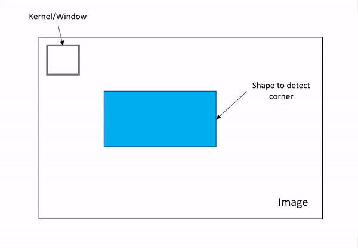
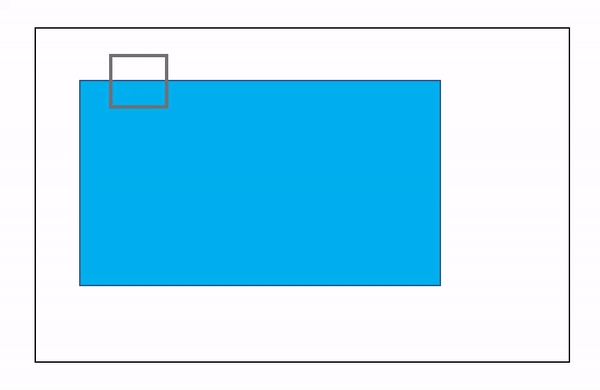

## Corner Detection in OpenCV
Corner Detection is detecting corner points in an image. Basically the popular algorithms in OpenCV are as follows:
1. **Harris Corner Detection**
2. **Shi-Tomasi Corner Detection**

Let's see the basic intution behind corner detection:
  In the animation below, there is a kernel or window which moves in particular alignment on the image containing the shape on which the corners are to be detected.

