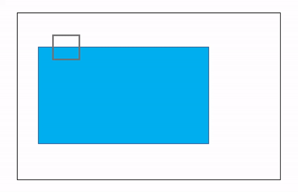

## Corner Detection in OpenCV
Corner Detection is detecting corner points in an image. Basically the popular algorithms in OpenCV are as follows:
1. **Harris Corner Detection**
2. **Shi-Tomasi Corner Detection**

Let's see the basic intution behind corner detection:
  
In the animation below, there is a kernel or window which moves in particular alignment on the image. The image contains the shape on which the corners are to be detected.
  


Here when the kernel moves we can see the intensity change in the kernel but in a particular axis either x-axis or y-axis. Here we can say that its an edge.
  


As the kernel moves towards the corner, the intensity change is in different axes. Thus a corner is detected.
  


### Harris Corner Detection
- Let's see the mathematical approach: <br>
The kernel is a matrix which can be formulated as:


Now on calculating the eigen values of the matrix M, lets determine the score of that matrix 'R':


here, 
- det(M) = λ1λ2
- trace(M) = λ1 + λ2
- k is free constant which varies between 0.04 to 0.06
- λ1 and λ2 are the eigen values of matrix M

- How the function looks like:
```python
detect = cv2.cornerHarris(img=gray, blocksize=5, ksize=5, k=0.04)
```
where,
- **img**: the image to be provided to process, specifically grayscale.
- **blocksize**: size of corner highlights. Higher the value, thicker the corners will shaded.
- **ksize**: aperture parameter and should be odd value lying between 0 and 31. Higher values increases the accuracy.
- **k**: it is a free constant which lies between 0.04 and 0.06.
- **detect**: the function returns the image. 

> one important point is cornerHarris function accepts **float32 value**.

- Output:


