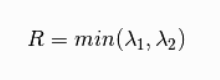
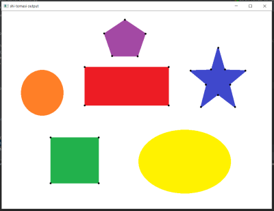

## Created by: Aditya Mahimkar
 📫 [**Mail Me**](mailto:mahimkaradi@gmail.com)

# Corner Detection in OpenCV
Corner Detection is detecting corner points in an image. Basically the popular algorithms in OpenCV are as follows:
1. **Harris Corner Detection**
2. **Shi-Tomasi Corner Detection**

**Let's see the basic intution behind corner detection:**
  
In the animation below, there is a kernel or window which moves in particular alignment on the image. The image contains the shape on which the corners are to be detected.
  


Here when the kernel moves we can see the intensity change in the kernel but in a particular axis either x-axis or y-axis. Here we can say that its an edge.
  


As the kernel moves towards the corner, the intensity change is in different axes. Thus a corner is detected.
  


## Harris Corner Detection
- Let's see the mathematical approach: <br>
The kernel is a matrix which can be formulated as:


Now on calculating the eigen values of the matrix M, lets determine the score of that matrix 'R':


here, 
- det(M) = λ1λ2
- trace(M) = λ1 + λ2
- k is free constant which varies between 0.04 to 0.06
- λ1 and λ2 are the eigen values of matrix M

Conditions to be considered:
1. When λ1 and λ2 are small, the region is **flat**.
2. When λ1 << λ2 or λ1 >> λ2 ie, there is a huge difference in the two values then the region is **edge**.
3. When λ1 and λ2 are large and are almost equal λ1 ~ λ2 then the region is **corner**.

- How the function looks like:
```python
detect = cv2.cornerHarris(img=gray, blocksize=5, ksize=5, k=0.04)
```
where,
  - **img**: the image to be provided to process, specifically grayscale.
  - **blocksize**: size of corner highlights. Higher the value, thicker the corners will shaded.
  - **ksize**: aperture parameter and should be odd value lying between 0 and 31. Higher values increases the accuracy.
  - **k**: it is a free constant which lies between 0.04 and 0.06.
  - **detect**: the function returns the image. 

> one important point is cornerHarris function accepts **float32 value**.

**Output**:


## Shi-Tomasi Corner Detection
<br>
The intution of this algorithm is quite similar to Harris Corner algorithm but the mathematical approach is bit different. We consider the minimum eigen value as the R score.



> Again over here the conditions related to R score and eigen values are similar.

- Shi-Tomasi is actually named as goodFeaturesToTrack function:
```python
corners = cv2.goodFeaturesToTrack(img=gray, maxCorners=23, qualityLevel=0.01, minDistance=15)
```
where,
  - **img**: the image to be provided to process, specifically grayscale.
  - **maxCorners**: the maximum number of corners to be displayed based on their score. To display all corners give 0 as argument.
  - **qualityLevel**: the quality level below which that corner points will be rejected.
  - **minDistance**: the minimum distance between two corners. So if two points have a distance less than this value one of them will be removed based on score.
  - **corners**: the function returns an array of cordinates of those corners to be displayed.

**Output**:



### What are the difference between two algorithms:

- When we compare the output images of both algorithms, it is found in Harris corner method that some reduntant points have been detected which in Shi Tomasi method are not being detected. This implies some **inefficiency in the Harris Corner algorithm**.
- We can control the number of corners to be displayed in Shi Tomasi method.

### Applications of Corner Detection
- Object Recognition
- Motion Tracking
- 3D Reconstruction
- Image Alignment and Stitching
