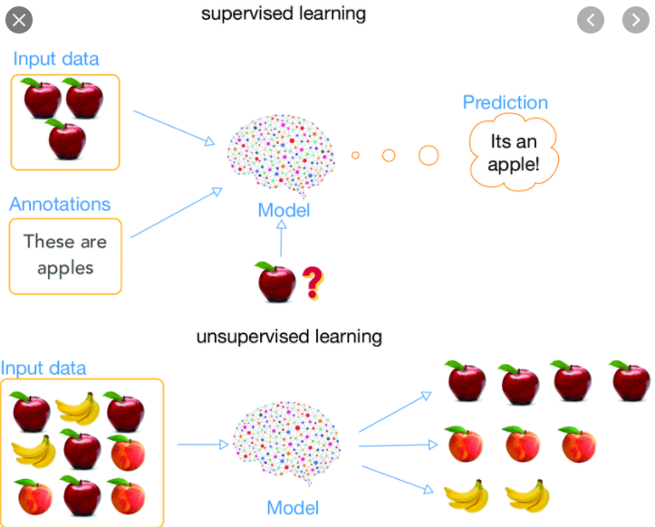
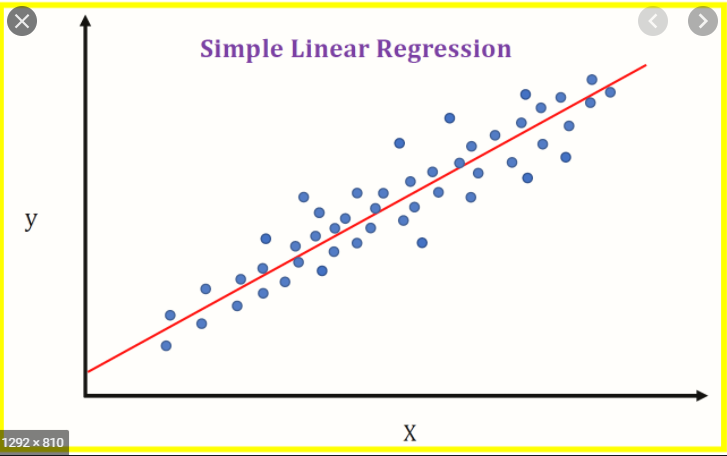
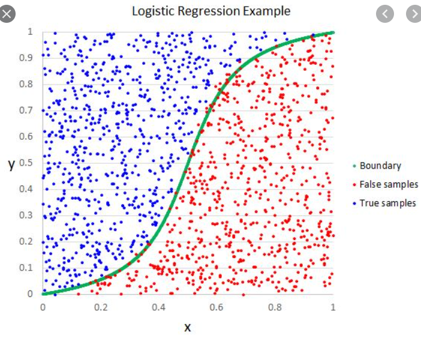
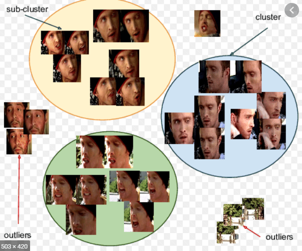
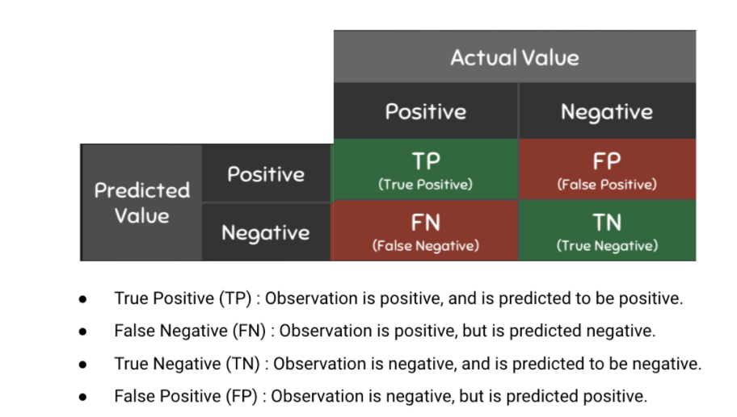
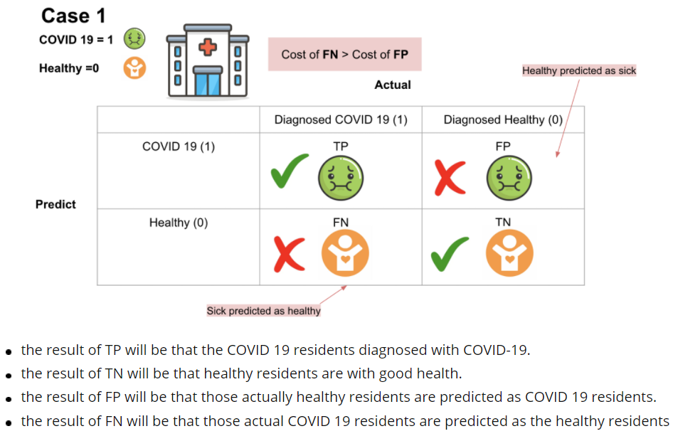
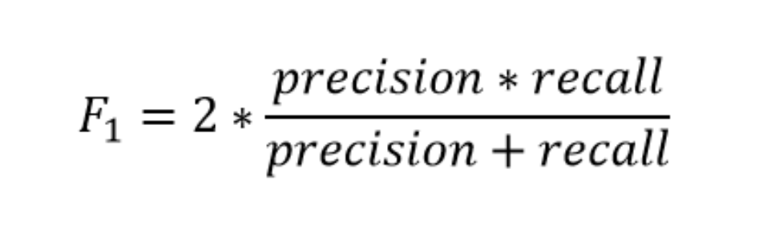
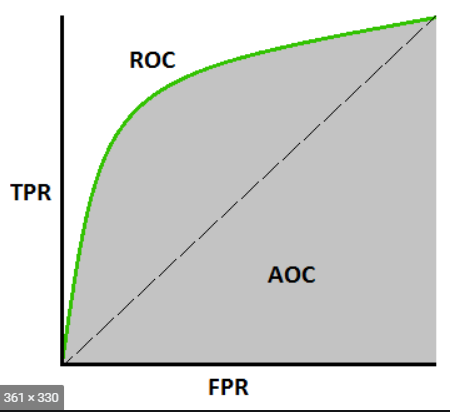

# Learnings from the Module
## Supervised Learning
* Supervised Learning is a machine learning approach where we are given labelled inputs i,e with targets.For each input we will have a mapped target with which we will train the model. Example: We are given characteristic physical features of list of fruits as features and the corressponding fruit name as target.
 
### There are two types of Algorithms in Machine Learning(Supervised Approach)
1. Regression
2. Classification
### Regression
* In this approach we are involved with continuous target variables.So basically we have to find a linear relationship between the input features and output features. 
* **Types of Regression Algorithms** 
  1. Linear Regression 
  2. Logistic Regression 
  3. Support Vector Regressor 
  4. Decision Trees Regressor 
* **Linear Regression** 
  This is a predictive modelling approach where we will be finding a Linear relationship between the input variables and output variables.
  The equation has the form Y= B0 + B1X, where Y is the dependent variable (that's the variable that goes on the Y axis), X is the independent variable (i.e. it is plotted on the X axis), B0 is the slope of the line and B1 is the y-intercept.
  
  The steps are using the datapoints we fit them to the line equation and we calculate either of the performance metrics(Mean Squared Error,Mean Absolute Error) and try to minimize the error after comparing with the labelled target.
  We initialise the parameters of the model(B1)to a certain value (usually randomly) and calculate this error for the whole training data. We iteratively modify these parameters in order to minimise this error. This is done with algorithms such as Gradient descent.
* **Logistic Regression** 
  This a different type of regression approach which is basically used for classification problems(Mostly binary classification).We will be fitting a line for segregating each class and since it will be a linear line thats why its termed as regression.
  So after we fit a linear line we pass the datapoint value in a non-linear function(sigmoid) and based on the result we classifiy the datapoint.
  
### Classification
* Classification is an supervised algorithm where the target data is in categories i.e discrete values rather continuous values.There are many algorithms which solves this problem of classification.
* **Types of Classification Algorithms** 
  1. Decision tree. 
  2. Logistic Regression. 
  3. Artificial Neural Network. 
  4. Random Forest. 
  5. Stochastic Gradient Descent. 
  6. Naive Bayes. 
  7. Support Vector Machine. 
  8. K-Nearest Neighbor. 
  
### Applications of Supervised Learning
  1. **Sentiment Analysis** 
  Sentiment Analysis is the process of determining whether a piece of writing is positive, negative or neutral. A sentiment analysis system for text analysis combines natural language processing (NLP) and machine learning techniques to assign weighted sentiment scores to the entities, topics, themes and categories within a sentence or phrase. Sentiment analysis helps data analysts within large enterprises gauge public opinion, conduct nuanced market research, monitor brand and product reputation, and understand customer experiences. In addition, data analytics companies often integrate third-party sentiment analysis APIs into their own customer experience management, social media monitoring, or workforce analytics platform, in order to deliver useful insights to their own customers.
  2. **Image Classification**
  In this problem we are required to classify images into labels with which the model is trained. We are required to create folders with each respective label and its corressponding images. 
  3. **Spam Filtering**
  Detecting spam emails is a very helpful application, this spam filteration technique easily detect any virus ,malware. In recent studies, it was found that about 56.87% of all emails revolving around the internet were spam in March 2017 which was a major drop from April 2014's 71.1% spam share.
  
  
## Unsupervised Learning 
* Unsupervised learning is another approach where we dont have labelled targets rather we have to find similarity only based on the input features.We are not known with the inputs and their outputs.Finding hidden pattern in unlabelled data.It looks for previously undetected patterns in a dataset with no pre-existing labels.
  Example
  1. Cluster Analysis
  2. Dimensionaltiy Reduction
  3. Anomaly Detection
* Imagine you have many faces images and no other data is given on those images. Using those images we have to cluster the ones similar i.e smiley faces in one cluster,sad faces in another cluster and so on.
 
### Clustering Analysis
Cluster is a group of objects that belongs to the same class. In other words, similar objects are grouped in one cluster and dissimilar objects are grouped in another cluster.
  1. A cluster of data objects can be treated as one group.
  2. While doing cluster analysis, we first partition the set of data into groups based on data similarity and then assign the labels to the groups.
  3. The main advantage of clustering over classification is that, it is adaptable to changes and helps single out useful features that distinguish different groups.

### Types of Clustering Approaches
  1. Hierarchical Method
  2. Density-Based Method
  3. Model-Based Method
* **Hierarchical Method** 
  This method creates a hierarchical decomposition of the given set of data objects.There are two approaches towards Hierarchical method.
  1. Agglomerative method
  2. Divisive method
* **Density Based method**<bItr>
  This method is based on the density. The basic idea is to continue growing the given cluster as long as the density in the neighborhood exceeds some threshold, i.e., for each data point within a given cluster, the radius of a given cluster has to contain at least a minimum number of points.
* **Model-Based Method**
  This method uses spatial distribution into consideration i.e, using distances between the clusters.
  Deciding the value of k(no. of clusters) can be done through **Elbow Method** and that can be validated with **Silhouette score**.
### Performance Metrics
* **Regression Measures**
  1. Mean Squared Error(MSE) 
    So after we will be getting the values from the fitted line,we will calculate the mean squared error and try to minimize it optimizing the parameters adn reaching towards the best fit line using Gradient Descent.
  2. Root Mean Squared Error(RMSE)
  3. Mean Absolute Error(MAE)
  4. R-Squared and Adjusted R-Squared Measure
    It determines the variance covered using the input features.Also, it hepls in avoiding **Curse of Dimensionality** by describing affect of new input features on the model.

* **Classification Measures**
  1. Confusion Metrics 
    Evaluation of the performance of a classification model is based on the counts of test records correctly and incorrectly predicted by the model. The confusion matrix provides a more insightful picture which is not only the performance of a predictive model, but also which classes are being predicted correctly and incorrectly, and what type of errors are being made. To illustrate, we can see how the 4 classification metrics are calculated (TP, FP, FN, TN), and our predicted value compared to the actual value in a confusion matrix is clearly presented in the below confusion matrix table.
     
  2. Precision 
    Precision is the ratio of True Positives to all the positives predicted by the model.Low precision: the more False positives the model predicts, the lower the precision.
  3. Recall(Sensitivity) 
    Recall (Sensitivity)is the ratio of True Positives to all the positives in your Dataset.Low recall: the more False Negatives the model predicts, the lower the recall.The idea of recall and precision seems to be abstract. Let me illustrate the difference in three real cases.
   
  4. F-1 Score 
    F-Measure provides a single score that balances both the concerns of precision and recall in one number. A good F1 score means that you have low false positives and low false negatives, so you’re correctly identifying real threats, and you are not disturbed by false alarms. An F1 score is considered perfect when it’s 1, while the model is a total failure when it’s 0.
     
  6. ROC-AUC 
    AUC - ROC curve is a performance measurement for classification problem at various thresholds settings. ROC is a probability curve and AUC represents degree or measure of separability. It tells how much model is capable of distinguishing between classes.
     
  7. Accuracy 
    This is base measure which is tested first after the model is built.But due to some scenarios like unbalanced dataset we cannot soley depend on it.
    
Thanks for Reading :sparkles: 
In case if you wanna reach me   &nbsp;&nbsp;
 &nbsp;&nbsp;  [ananyd36@gmail.com]
    
    
  
  
