# Introduction to Pandas for NLP
Pandas is an open-source library that is made mainly for working with relational or labeled data both easily and intuitively. The library provides easy access to 
different functions for cleaning and processing data for any purpose. Pandas uses the Numpy library for all its mathematical purposes and this makes it compatible with every other library built on top of numpy, including but not limited to matplotlib, Xarray, sparse etc.
Pandas is especially useful in different Machine Learning fields and it's applications are not limited to manipulating numerical data. It is also extremely useful in manipulating textual data, something that comes in handy when working in NLP

## Key Features of Pandas
* Fast and efficient DataFrame object with default and customized indexing.
* Tools for loading data into in-memory data objects from different file formats.
* Data alignment and integrated handling of missing data.
* Data alignment and integrated handling of missing data.
* Label-based slicing, indexing and subsetting of large data sets.
* Columns from a data structure can be deleted or inserted.
* Group by data for aggregation and transformations.
* High performance merging and joining of data.
* Easy handling and manipulation of textual data.

## Installing Pandas
Open the terminal and type the following command in:
```
pip3 install pandas
```
If pip is not already installed, you might meet an error message, if that happens use the following command in the terminal
```
sudo apt-get install python3-pip
```
## Getting Started
In this tutorial we will be starting from the basic operations that pandas allows and working our way upto some manipulation and inference techniques that are an absolute necessity for working in NLP
### Importing Pandas and Reading CSV Files

```python
import pandas as pd
```
We willbe using a csv file named Tweets.csv to show the different applications of pandas in NLP. To load the csv file:
```python
data = pd.read_csv("Tweets.csv")
```
This loads the csv file in the variable 'data' as a dataframe.
## Data Information
To effectively use the functions at our disposal, we need to know everything about the data that we are going to be manipulating, pandas provides an array of different functions for this purpose.
### .head() method
To simply view the dataframe:
```python
data.head(10)
```
The output looks something like this:
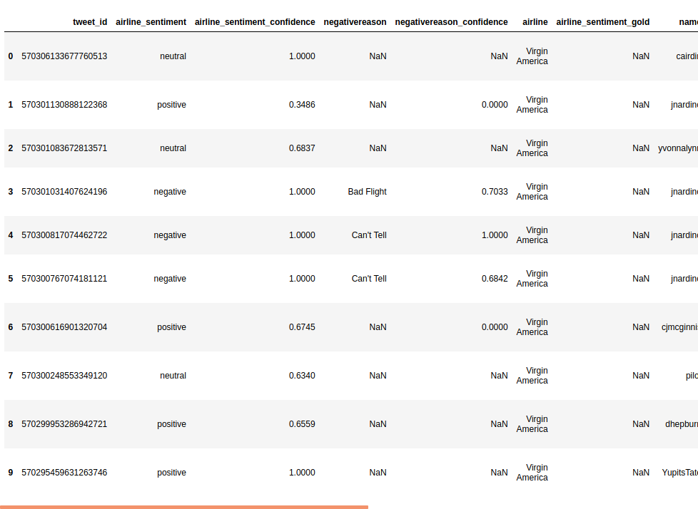
This provides a birds-eye view of the whole dataset and can be used at any stage of data cleaning/manipulation to get a sense of how the changes you are making are affecting the whole dataframe.
### .shape method
To get the number of rows and columns in DataFrame, we use the shape method:
```python
data.shape 
```
The output shows that the DataFrame has 14640 rows and 15 columns:


### .info() method
This method is used to get a summary about the whole DataFrame in an easy to read manner:
```python
data.info() 
```
The output shows the summary of the whole DataFrame:

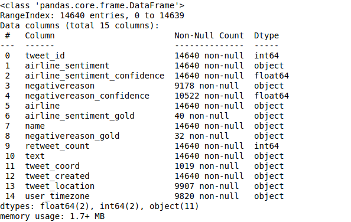
### .dtypes method
This method is used to specifically find out the data type of the values in each columns:
```python
data.dtypes
```
The output displays all the datatypes in the DataFrame:

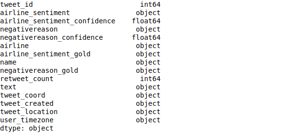
## Data Extraction
For the effective use of the available data, more often than not, we are required to extract certain parts of the data that conforms to certain constraints. Pandas provides easy access to function that enable us to do this.
### Column Extraction
To extract a specific column, we write:
```python
negr = data['negativereason']
negr.head(10)
```
The output shows the values in the 'negative_reason' column:

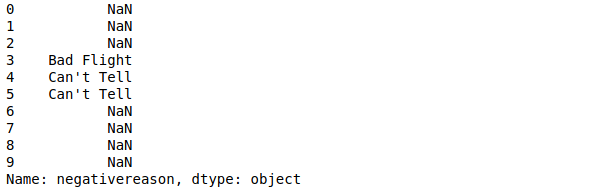

### Row Extraction
To extract the values from multiple columns that conform to certain constraints, we write:
```python
posrec = data[data['airline_sentiment'] == 'positive'] 
posrec.head(5)
```
The output contains all the rows in which the column 'airline_sentiment' has the 'positive' entry:
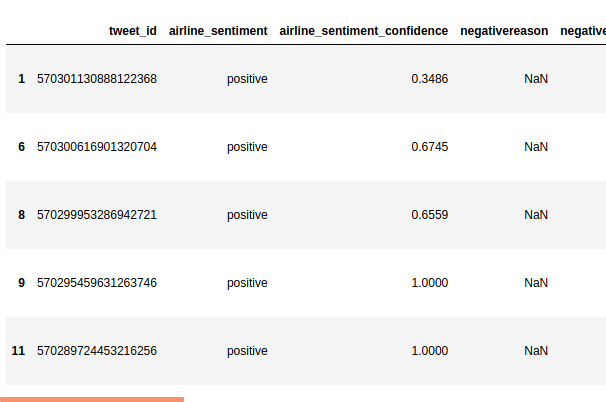
#### Note : Pandas allows the constraint to be anything, ranging from numerical values to string, this makes the NLP tasks extrmely easy to do with pandas.

## Data Manipulation
After the data of interest has been extracted, some cleaning is required before it can be inserted into Language Models or Other Algorithms. To achieve our objective, we will be using pandas again.
### .describe method
It is used to gather information about a pandas series or DataFrame.:
```python
new = data['airline_sentiment']
new.describe 
```
The output is a description of the 'new' series:

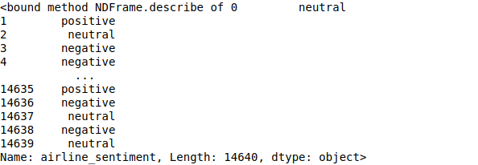

### .astype method
More often than not, we are faces with data that is incompatible for our purposes, therefore, we have to change the datatype so that it fits the requirements, for this we use the astype() method:

```python
new.astype('string')
```
The output is the contentes of 'new' converted to string datatype:

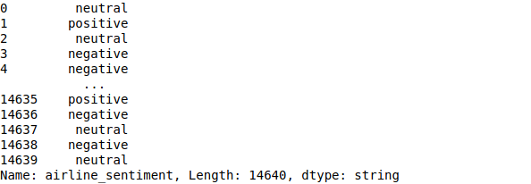

### Working with NaNs
NaN is a numeric datatype which stands for 'Not A Number'. A lot of Datasets out there have NaN values in them and therefore it is esssential to get rid of them before we proceed any further.
### Are there any NaN values?
To find out if there are any NaN values in the series we use the following method:

```python
data['airline_sentiment'].isnull().values.any()
```
The output is false which means that this particular row does not have any NaN values:


When we employ the same method on anohter column:

```python
data['negativereason_confidence'].isnull().values.any()
```
The output is :


### How Many NaNs?
To find out the number of NaN values in the series we use the following method:

```python
data['negativereason_confidence'].isnull().sum()
```
The output is false which means that this particular row does not have any NaN values:


### Replacing NaNs
To replace the NaN values in a series with the input of our choice we use the fillna method:

```python
data['negativereason_confidence'].fillna(data['negativereason_confidence'].mean())
```
The output is the modified series where the NaN values have been replaced with the mean of the whole column:

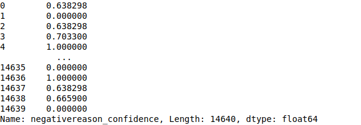

When we see the .isnull output after the operation:

```python
data['airline_sentiment'].isnull().values.any()
```
The ouput is :


## Drawing Inference
One of the central themes of NLP is to extract information from the given set of words which is useful. To achieve this to some extent, we will be using NLP to break down the textual data and find the patterns hidden in it.
### Histograms
Histograms are one of the most powerful tools when it comes to NLP, it can be used to get a picture of what the data is telling.
To get started we will try to see what the general public opinion is of all the airlines:

```python
pos = data[data['airline_sentiment'] == 'positive'].shape[0]
neg = data[data['airline_sentiment'] == 'negative'].shape[0]
neu = data[data['airline_sentiment'] == 'neutral'].shape[0]
```
This will store the number of each type of values present in the column 'airline_sentiment'. Next we will import matplotlib to plot the histogram:

```python
import matplotlib.pyplot as plt
```
Now we will plot the values using matplotlib:

```python
plt.bar(10,pos,3, label="Positive")
plt.bar(15,neg,3, label="Negative")
plt.bar(20,neu,3, label="Neutral")
plt.legend()
plt.ylabel('Number of examples')
plt.title('Proportion of examples')
plt.show()
```
The output is the following histogram, which shows that an overwhelming people find the airlines unsatisfactory:

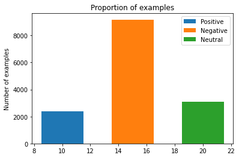

### Plotting With Pandas
For plotting the Histograms, we do not need matplotlib as pandas provides inbuilt methods for plotting the values.
To find the biggest reason why people are finding airlines services unsatisfactory, we will plot a histogram of the different reasons and their frequency, this time, using pandas:

```python
fig = plt.figure(figsize = (20,20))
ax = fig.gca()
negr.hist(ax = ax)
```
The code above produces a histogram of size 20X20:

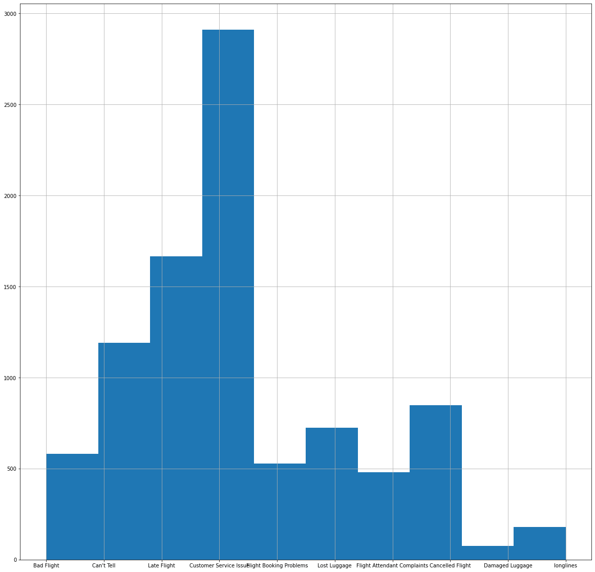

As we can see in the histogram, 'customer service issue' is the biggest reason behind the dissatisfaction.
### Case Studies
To further break the data down, we need to find out the level of dissatisfaction with each airline. This allows us to infer where the changes need to be made.

### .unique method
This method is used to determine the uniques values present in a column, we will use it to find out how many different airlines have been polled:

```python
data.airline.unique() 
```
The output is the list of airlines present in the dataset:

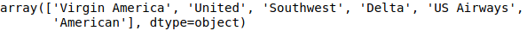

### Plotting for each airline
Now we will plot the proportion of the result for each airline, starting from **Virgin America**:

```python
va = data[data['airline'] == 'Virgin America']['airline_sentiment']
va.hist()
```
The output is the following histogram:

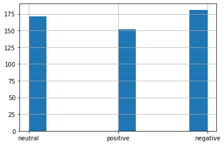

**United**

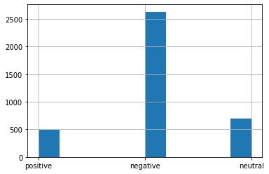

**Southwest**

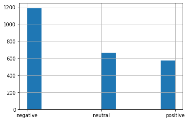

**Delta**

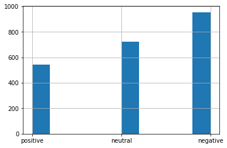

**US Airways**

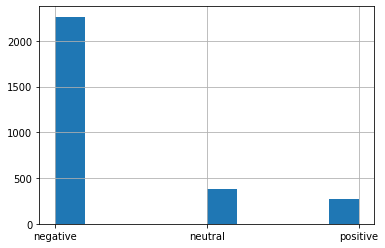

**American**

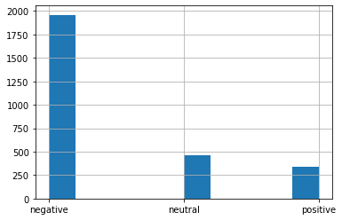

The breaking down of data has shown that except for Virgin America, all the other airlines in this dataset are doing very poorly in the eyes of the people.
## Conclusion
This is the end of this tutorial. The methods and function used in this tutorial are extrmemly useful in real life situation where dealing with large textual datasets can be a hassle otherwise. Pandas is an extremely powerful tool for handling any dataset, hopefully after reading this, you can use the skills learned to tackle some of the problems in NLP.

## Author
* **Aryan Roy** - [Github](https://github.com/aryan26roy), [Linkedin](https://www.linkedin.com/in/aryan-roy-914458189/)

## Acknowledgements
* DevIncept Mentor
* GeeksforGeeks
* Pandas Documentation
* Medium.com

