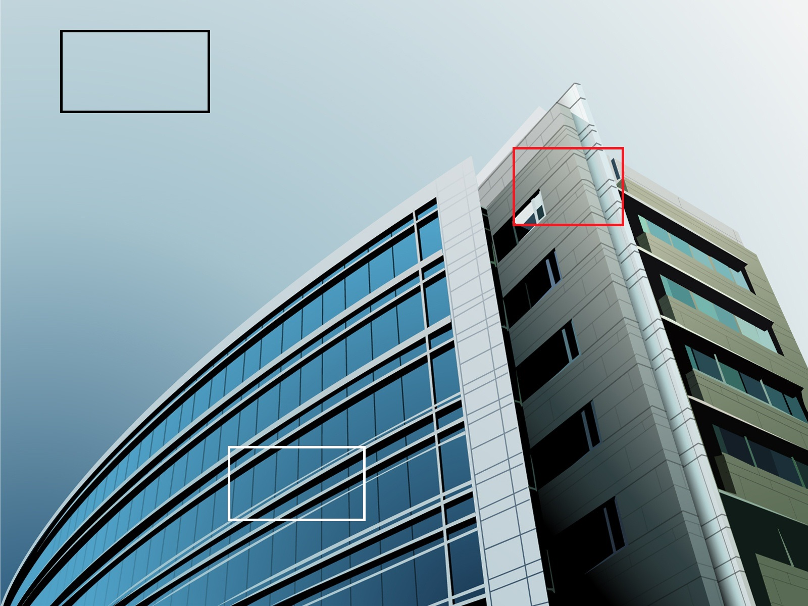

# Name: Avinash Mirgal
***
# Topic: Feature Detection And Description in OpenCV
*   **What is Feature Detection and Description?**
    
    In our Daily life we humans 
    the one thing or object from another flawlessly as we don't pay the attention to it that how does this happen, It all programs in our brain already. what we do if we saw an image or object, we closely look into in and try to find a pattern to distinguish that image or object from another and it all happens in the background.
    
    
    
    In the above image when we look at it our brain starts to find a pattern like the black box is  sky and the white box is show the windows of the building and the red box shows the building walls
    These all are the features that we find just by looking at the image.
    once we find this feature in this image we can find them in other images or objects. and this process is **Feature Detection** and after finding a feature we describe that 
    in our own word like a black box is the sky the white box is window etc. and we search the same features in other images, basically we are describing the feature and this is called 
    **Feature Description**, same do by computer to describe the region around the box so that it can find that in other images and objects.
    
*  **There are various algorithm we can use for Feature Detection some as follows:**

    - Harris Corner Detection
    - Shi-Tomasi Corner Detector
    - SIFT algorithm(Scale-Invariant Feature Transform)
    - SURF (Speeded-Up Robust Features)
      
      SIFT is great but it is slow, so people need a faster version for Features detection so in early 2006 three people, Bay, H., Tuytelaars, T. and Van Gool, L, published the paper, which presents a new algorithm called SURF
    - FAST algorithm (Features from Accelerated Segment Test)
      
      All above algorithm is useful in some or other way but they are not that much useful in the real-life application that's why this algorithm was proposed by Edward Rosten and Tom Drummond in their paper "Machine learning for high-speed corner detection" in 2006 and Later revised it in 2010.
     
    - BRIEF (Binary Robust Independent Elementary Features)
      
      SIFT uses floating-point number so its take 512bytes dim vector for descriptors and SURF use 256bytes for descriptors and creating this vector for thousand of features its take lots of memory and it is very difficult for resource-restricted application like embedded systems larger the memory its take lots of time for matching.
      that's why BRIEF is introduced in and it is a faster method feature descriptor calculation and matching. one drawback is that it only features descriptor we need to use feature detection with this to get the final result.
    - ORB(Oriented FAST and Rotated BRIEF)
    
      SIFT and SURF are good in there own way, but what if you have to pay every year to use them in your applications and that cost a lot? they are patented so we need to pay to use them. To solve that issue, OpenCV developer came up with a new free alternative to SIFT & SURF, and that is ORB(Oriented FAST and Rotated BRIEF).
      
 ##### Once we learn about feature detection and description we need to know about how that feature is going to match with other images in OpenCV we have two methods to do this task as follows:
 
 - Brute-Force Matcher
 
    In this, its simply take descriptor of one feature in the first set and match with all other feature in the second set with distance calculation between them and return the closest one.
    
 - FLANN based Matcher
 
   FLANN is Fast Library for Approximate Nearest Neighbors. it contains various algorithms to find out Nearest Neighbors and it is faster than Brute-force matcher.
   
  ### Get the Code Example <a href="https://github.com/AvinashMirgal/Open-contributions/blob/master/Avinash_OpenCV_Feature_Detection_and_Description.ipynb" title="Example code">Here</a>
