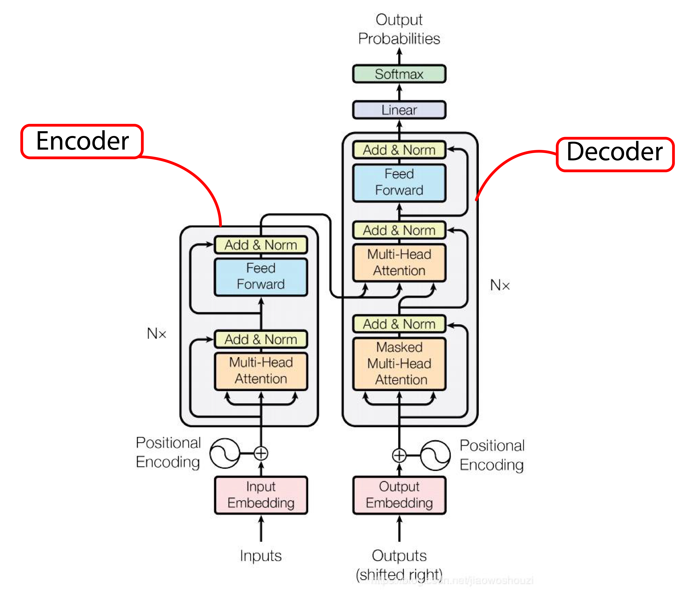

# BERT (Bidirectional Encoder Representations from Transformers)
## Introduction:
Before diving into **BERT** and its processes, below are two sentences for us to evaluate:
1. `I sat by the river bank`
1. `I made a bank deposit`

Notice the word `bank`; As for us humans, we can efficiently figure out the meaning of the word `bank` basis the context. Unfortunately, some language processes have trouble 
identifying the word `bank` based on the context. But fortunately for us, we have overcome this problem with the help of Google's **BERT**.

> **BERT** is a method of pre-training on a large corpus of unlabeled text and then fine-tuning and implementing that model to perform NLP tasks like Text Summarization, 
Question Answering, and Sentiment Analysis.

Language models such as **ELMo** & **ULMFit** follow the narrative of being either *unidirectional* or *shallowly bi-directional*. For example, 
if the sentence `I need to go to the bank to make a deposit!` is fed to a unidirectional model reading from left->right, 
the representation of `bank` is determined based on `I need to go to the` but not `to make a deposit!`.

There is a high chance for the right->left unidirectional models to make a similar misreading. BERT can solve this problem by 
reading the entire sentence of words simultaneously, bidirectional, understanding the whole context. Therefore it is known for its *deep bidirectionality*. 

Below is a diagram of 3 models which follows deeply bidirectional, unidirectional, and shallow bidirectional respectively:

<a href="https://ai.googleblog.com/2018/11/open-sourcing-bert-state-of-art-pre.html">source</a>

In the above image, although **ELMo** seems to be bidirectional, it just merely learns the left->right & right->left context separately and concatenates both, 
losing some contexts in the process. Therefore it's a shallowly bidirectional model, unlike BERT.

## Understanding BERT:
As the title suggests, BERT stands for **B**idirectional **E**ncoder **R**epresentations from **T**ransformers, meaning these are encoders borrowed from a transformer. 

A whole transformer looks as below:

A transformer generally consists of 2 components:
1. **Encoder**
1. **Decoder**

The input of a sentence enters the encoder as it's passed through a transformer. The encoder's job is to understand the context of the sentence as a whole simultaneously and generate embeddings for each word. These embeddings are nothing but vectors that encapsulates the meaning of the word and later passed down to the decoder, which eventually translates to the desired language.

Separate the encoder from the transformer and stack several encoders; You get a **BERT** model.

## BERT's Architecture:

BERT has 2 versions:
- **BERT Base** - 12 layers (transformer blocks), 12 attention heads, and 110 million parameters.
- **BERT Large** - 24 layers (transformer blocks), 16 attention heads and, 340 million parameters.

<a href='http://jalammar.github.io/illustrated-bert/'>source</a>

## How BERT works:

The training of BERT is done in 2 phases:
1. **Pretraining**: The model understands a language.
1. **Fine Tuning**: The model learns a specific task.

### Pretraining: 

The goal of pretraining is to know what is language and what is context. To achieve the goal, BERT is pre-trained on 2 unsupervised tasks:
- **Masked Language Modelling (MLM)**.
- **Next Sentence Prediction (NSP)**.

#### MLM:

In this task, a word from the input sentence is masked, and the model tries to predict the word by understanding the context of the sentence using bidirectionality. For example, "I went to the `[MASK]` to buy some milk.". The model tries to predict the masked word based on the context and fills in the blank. The model itself replaces 15% of the words in the sequence with a `[MASK]` token.

As a sequence of words passes through MLM it:
1. Adds a classification layer on top of encoder output.
1. Multiplies the output vectors by the embedding matrix and transforming them into vocabulary dimensions.
1. Calculating the probability of each word in the vocabulary using softmax activation.

<a href='https://towardsdatascience.com/bert-explained-state-of-the-art-language-model-for-nlp-f8b21a9b6270'>source</a>

BERT's loss function considers only the masked predictions, ignoring the predictions of the non-masked tokens. As a result, the model has increased *context-awareness* but converges slower than the directional models.

#### NSP:
The task of **Next Sentence Prediction** is pretty straight forward. It is like a binary classification. Suppose there are 2 sentences, Sentence A & Sentence B. NSP tries to predict if Sentence B follows Sentence A. Based on this method, the model takes in sentences, say 10,000; pairing them would make 5,000 pairs. During training, the model splits the pairs in a way that 50% of them have the 2nd sentence follow the 1st as in the original document. The remaining 50% have a random sentence chosen from the corpus as the 2nd sentence.

Before the sentence enters the model, the model tries to distinguish between the sentences and processes the input in the following way:

1. The token embeddings are the pre-trained embeddings where the main paper uses **"WordPiece"** of 30k vocabulary.
1. The segment embedding is the sentence number that is encoded into a vector.
1. The position embedding is the position of the word within the sentence that is encoded into a vector.

<a href='https://arxiv.org/abs/1810.04805'>source</a>

By adding these 3 vectors, we get an embedding vector which we use as the input to BERT. To this input, a `[CLS]` token is attached at the start of the sentence whereas a `[SEP]` token is attached at each end of the sentence.

On the output side of the BERT model, `C` indicates the output of the NSP; `1` meaning the 2nd sentence follows the 1st and `0` otherwise. `T1, T2,..., Tn` are word vectors that indicate the output of the corresponding MLM task process. All word vectors are of the same size and are generated simultaneously.

Each word vector is passed to a fully connected neural network consisting of neurons equal to the number of tokens in the vocabulary; in this case, it's 30k. The word vector is converted into distribution by applying *softmax activation*. This distribution is compared with the actual one-hot encoded output and is trained by using the cross-entropy loss. This loss only considers the prediction of the `[MASK]ed` words and ignores the rest. This way it can learn by predicting the right `[MASK]ed` words.

### Fine-tuning:
This process is *supervised* where we fine-tune the model to perform a specific task:

1. Classification tasks such as sentiment analysis can be done the same process as the Next Sentence Prediction.
1. In a Name Entity Recognition, the BERT model can learn from the output vector of each token into a classification layer that predicts the NER label.
1. In Question Answering tasks, the BERT model can be trained by learning 2 extra vectors, which mark the beginning and the end of the answer.

### Conclusion:
**BERT** has indeed inspired many recent NLP architectures such as RoBERTa, OpenAI's GPT-2, XLNet, Google's TransformerXL and ERNIE2.0. Although modern NLP architectures may surpass **BERT's** performance, one cannot deny the fact that **BERT** has revolutionized the world of **Natural Language Processing**.

------------

#### Name: Vineel Noel Vempati
Links: [LinkedIn](https://www.linkedin.com/in/vineel-noel-vempati/), [GitHub](https://github.com/vineelnoel/)
