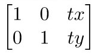

# Basic Operations on image in OpenCV

There are so many fucntions present in OpenCV for image processing.
now we will learn various operations we can perform on the image for image processing one by one.

#### list of operations:
    1.Grayscaling
    2.Image Translations
    3.Image Rotation
    4.Scaling and Croping
    5.Edge detection, Sharpning, Thresholding, Erosion and Dilation
    6.Arithmetic and bitwise Operations

## 1. Greyscaling

Greyscaling is the process of converting an image from  format RGB, CMYK, HSV, etc. to shades of grey. the greyscale image is varies between complete white and complete black. 
##### for the above operation cv2.cvtColor() this function is used.

### Applications Of Greyscaling:
1. There are so many algorithms that can customized to work only with the greyscaled images for e.g. Canny edge detection function pre-implemented in OpenCV library works on Grayscaled images only.
2. There is dimensional reduction in greyscale image as RGB image has 3 channels and greyscaled image has only 1 channel.

## 2. Translation 
Translation is the process of shifiting image from one location to another location. 
this can be done using transformation matrix

the tx and ty elements of the matrix shows the shifting of image to x-direction and y-direction respectively.

##### we can use the cv2.wrapAffine() function to implement these translations. This function requires a 2×3 array. The numpy array should be of float type.

### Application Of Translation:
1. Shifting of image .
2. Hiding part of the image.
3. Animation to the image by using loop to translation.
4. To crop the image.

## 3. Rotation 
Roation opearation is used to rotate the image in multiplies of 90 degree. 
##### The cv2.rotate() fucntion is used for this operation.

### Application Of Rotation:
1. To display the reflection of image.

## 4. Scaling and Cropping 

### 1) Scaling:
&nbsp;&nbsp;&nbsp;&nbsp;&nbsp;&nbsp;&nbsp;&nbsp;&nbsp;&nbsp;&nbsp;&nbsp;&nbsp;&nbsp;&nbsp;&nbsp;&nbsp;&nbsp;&nbsp;&nbsp;&nbsp;&nbsp;&nbsp;&nbsp;&nbsp;
This opeartion is used to change the size of the image. 
##### cv2.resize() funtion is used to perform this operation.
#### Application :
To fit one image into another image.
### 2) Croping:
&nbsp;&nbsp;&nbsp;&nbsp;&nbsp;&nbsp;&nbsp;&nbsp;&nbsp;&nbsp;&nbsp;&nbsp;&nbsp;&nbsp;&nbsp;&nbsp;&nbsp;&nbsp;&nbsp;&nbsp;&nbsp;&nbsp;&nbsp;&nbsp;&nbsp;
This opeartion is used to crop the image. 
in this all we are doing is slicing arrays. we first supply the startY and endY coordinates, followed by the startX and endX coordinates to the slice. 
for e.g cropped = image[70:170, 440:540]
#### Application :
To remove the unwanted part of the image.

## 5. Edge detection, Sharpning, Thresholding, Erosion and Dilation
 
### 1) Edge detection:
&nbsp;&nbsp;&nbsp;&nbsp;&nbsp;&nbsp;&nbsp;&nbsp;&nbsp;&nbsp;&nbsp;&nbsp;&nbsp;&nbsp;&nbsp;&nbsp;&nbsp;&nbsp;&nbsp;&nbsp;&nbsp;&nbsp;&nbsp;&nbsp;&nbsp;
It involves the detecting the sharp edges in the image.
##### there are several algorithms present to perform this opearation.we will use cv2.Canny() function.
#### Application :
1) Object detection.
2) Image recognition.
### 2) Sharpning:
&nbsp;&nbsp;&nbsp;&nbsp;&nbsp;&nbsp;&nbsp;&nbsp;&nbsp;&nbsp;&nbsp;&nbsp;&nbsp;&nbsp;&nbsp;&nbsp;&nbsp;&nbsp;&nbsp;&nbsp;&nbsp;&nbsp;&nbsp;&nbsp;&nbsp;
This opeartion is used to sharpen the image 
##### cv2.filter2D() this fucntion is used to perform the sharpen/blur opeeration It has 3 parameters in which one is kernal. kernal is nothing but the numpy array for sharpning image. for e.g kernel_3x3 = np.ones((3, 3), np.float32) / 9

### 3) Thresholding :
&nbsp;&nbsp;&nbsp;&nbsp;&nbsp;&nbsp;&nbsp;&nbsp;&nbsp;&nbsp;&nbsp;&nbsp;&nbsp;&nbsp;&nbsp;&nbsp;&nbsp;&nbsp;&nbsp;&nbsp;&nbsp;&nbsp;&nbsp;&nbsp;&nbsp;Here, the matter is straight forward. If pixel value is greater than a threshold value, it is assigned one value (may be white), else it is assigned another value (may be black). The function used is cv2.threshold. First argument is the source image, which should be a grayscale image. Second argument is the threshold value which is used to classify the pixel values. Third argument is the maxVal which represents the value to be given if pixel value is more than (sometimes less than) the threshold value. OpenCV provides different styles of thresholding and it is decided by the fourth parameter of the function. Different types are:

- cv2.THRESH_BINARY
- cv2.THRESH_BINARY_INV
- cv2.THRESH_TRUNC
- cv2.THRESH_TOZERO
- cv2.THRESH_TOZERO_INV

### 4) Erosion and Dilation :
&nbsp;&nbsp;&nbsp;&nbsp;&nbsp;&nbsp;&nbsp;&nbsp;&nbsp;&nbsp;&nbsp;&nbsp;&nbsp;&nbsp;&nbsp;&nbsp;&nbsp;&nbsp;&nbsp;&nbsp;&nbsp;&nbsp;&nbsp;&nbsp;&nbsp;Erosion and Dilation are the two morphological operations which are a set of operations that process images based on shapes.
##### cv2.erode(), cv2.dilate() these two functions are used to perform the Erosion and Dilation.

**Erosion:**
1) Erodes away the boundaries of foreground object
2) Used to diminish the features of an image.

**Dilution:**
1) Increases the object area
2) Used to accentuate features

### Applications:
**Erosion:**  
It is useful for removing small white noises.
Used to detach two connected objects etc. 
 

**Dilation:**  
In cases like noise removal, erosion is followed by dilation. Because, erosion removes white noises, but it also shrinks our object. So we dilate it. Since noise is gone, they won’t come back, but our object area increases.
It is also useful in joining broken parts of an object.

## 6. Arithmetic Operations on Images using OpenCV 

1) Addition and Subtraction.
2) Bitwise Operations.

### 1) Addition and Subtraction :
&nbsp;&nbsp;&nbsp;&nbsp;&nbsp;&nbsp;&nbsp;&nbsp;&nbsp;&nbsp;&nbsp;&nbsp;&nbsp;&nbsp;&nbsp;&nbsp;&nbsp;&nbsp;&nbsp;&nbsp;&nbsp;&nbsp;&nbsp;&nbsp;&nbsp;&nbsp;&nbsp;&nbsp;&nbsp;&nbsp;&nbsp;&nbsp;&nbsp;&nbsp;&nbsp;&nbsp;We can add and substract images in opencv by using cv2.addweighted() and cv2.substract() functions respectively,
but the two images should be of same height and width.

#### Applications :
1) Analyzing the input image properties.
2) Enhancing the input image properties.

### 2) Bitwise operations :
&nbsp;&nbsp;&nbsp;&nbsp;&nbsp;&nbsp;&nbsp;&nbsp;&nbsp;&nbsp;&nbsp;&nbsp;&nbsp;&nbsp;&nbsp;&nbsp;&nbsp;&nbsp;&nbsp;Bitwise operations are used in image manipulation and used for extracting essential parts in the image. 

Bitwise operations used are :
- AND
- OR
- XOR
- NOT

The Bitwise operations should be applied on input images of same dimensions
following functions are used to perform bitwise operations on images.

    cv2.bitwise_and() 
    cv2.bitwise_or() 
    cv2.bitwise_exor() 
    cv2.bitwise_not() 

#### Applications : 
1) Image masking.
2) Enhancing the properties of input image . 

 

