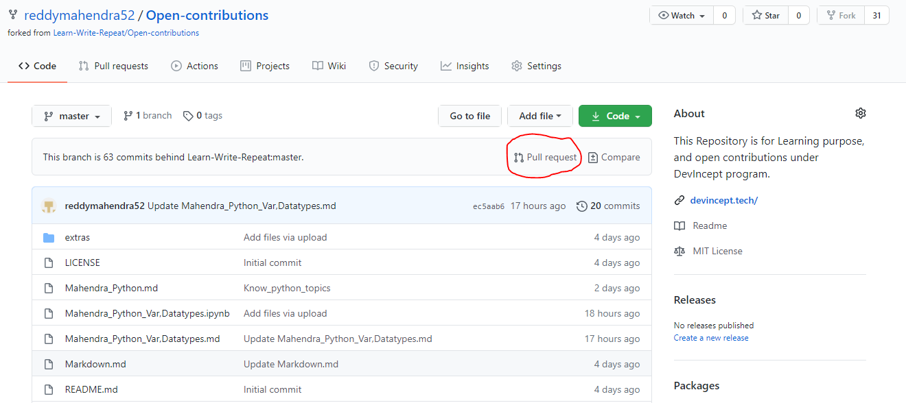
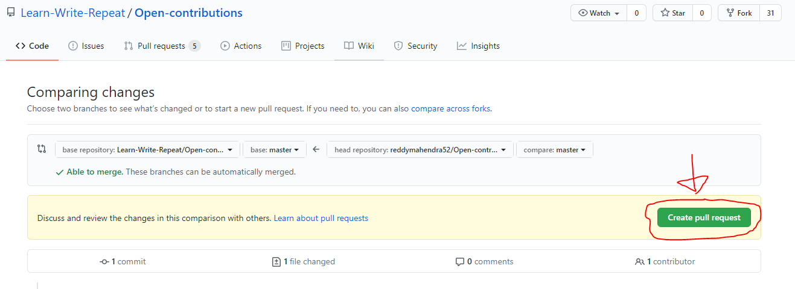
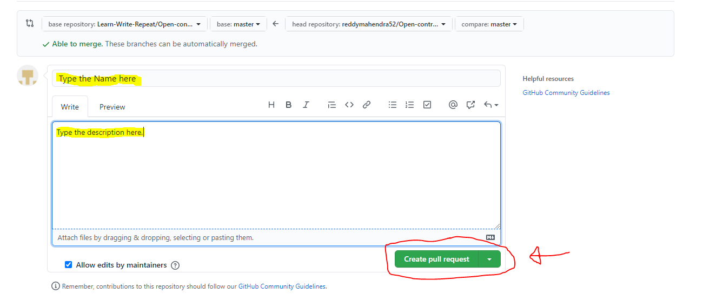

# What is a Pull Request??
**Pull Requests** are a feature that makes it easier for developers to collaborate with each other.Its a  a user-friendly web interface for discussing proposed changes before integrating them into the official project.

A pull request is a method of submitting contributions to an open development project.
In other words its a simple, web-based way to submit your work (often **called** *“patches”*) to a project in order to make it better.

# What does it mean??
 A pull request occurs when a developer asks for changes committed to an external repository to be considered for inclusion in a project's main repository.
 
# How to create one??
## Follow the underlying steps and you are good to go:
1. Once you have done all the changes in the **forked repository**, and ready to create a **Pull Request**.Click on the **Pull Request** icon you can see on your screen on top of the files as
   shown in the picture below.

2. Then another page will come, like in the picture shown below. In that also click on the button named **Create Pull Request**.

3. After that a dialogue box will open. Fill in the Name and Description and finally one more time click on the button **Create Pull Request**.

# Hooray!!! :smile::smile:
## You have created your *First Pull Request.*
