# Errors & Exceptions

## What are Errors?
Errors are the problems in a program due to which the program will stop the execution. They are almost always the fault of the programmer. The process of finding and eliminating errors is called debugging. Basically, there are two types of Errors:-
* Syntax Error
* Logical Error

### Syntax Error
Syntax errors occurs when we violate the rules of Python and they are the most common kind of error that we get while learning a new language. For example,

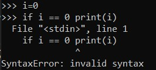

In the aforementioned code we have missed the ':' before the keyword print.

Common Python Syntax errors include:
* leaving out a keyword
* putting a keyword in the wrong place
* leaving out a symbol, such as a colon, comma or brackets
* misspelling a keyword
* incorrect indentation
* empty block

### Logical Error
Logical errors are the most difficult to fix. They may occur due to wrong algorithm or logic to solve a particular program. They occur when the program runs without crashing, but produces an incorrect result. You won’t get an error message, because no syntax or runtime error has occurred. You will have to find the problem on your own by reviewing all the relevant parts of your code – although some tools can flag suspicious code which looks like it could cause unexpected behaviour.

Here are some examples of mistakes which lead to logical errors:
* using the wrong variable name
* indenting a block to the wrong level
* using integer division instead of floating-point division
* getting operator precedence wrong
* making a mistake in a boolean expression
* off-by-one, and other numerical errors

## What are Exceptions?
Even if a statement is syntactically correct, it may still cause an error when executed. Such errors that occur at run-time(or during execution) are known as exceptions. An exception is an event, which occurs during the execution of a program and disrupts the normal flow of the program's instructions. When a program encounters a situation which it cannot deal with, it raises an exception. Let us see some examples in which exceptions occurs.

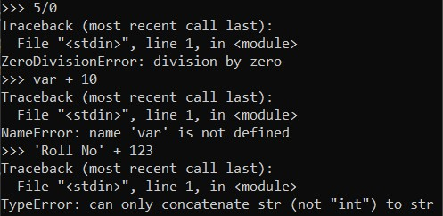

## Handling Exceptions
We can handle exceptions in our program by using try block and except block. A critical operation which can raise exception is placed inside the try block and the code that handles exception is written in except block. The Syntax for try-except block can be given as:

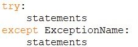

The picture below shows you how the exception is handled in a program.

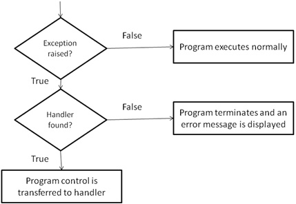

Now, let's take a look at an example to better understand how an exception is handled in a program.

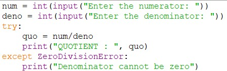

The output of the aforementioned program is given below:

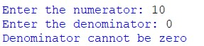

## Multiple Except Blocks
Pyhton allows you to have multiple except blocks for a single try block. The block which matches with the exception generated will get executed. A try block can be associated with more than one except block to specify handlers for different exceptions. However, only one handler will be executed. Exception handlers only handle exceptions that occur in the corresponding try block. The syntax for specifying multiple except blocks for a single try block can be given as,

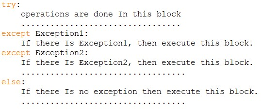

Now, let's take a look at an example to better understand this.

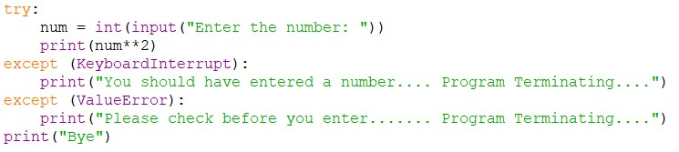

The output of the aforementioned program is given below:

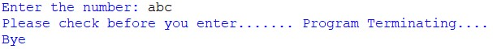

Note that after the execution of the except block, the program control goes to the first statement after the except block for that try block.

## Error checks vs exception handling
Exception handling gives us an alternative way to deal with error-prone situations in our code. Instead of performing more checks before we do something to make sure that an error will not occur, we just try to do it – and if an error does occur we handle it. This can allow us to write simpler and more readable code. Let’s look at a more complicated input example – one in which we want to keep asking the user for input until the input is correct. We will try to write this example using the two different approaches:

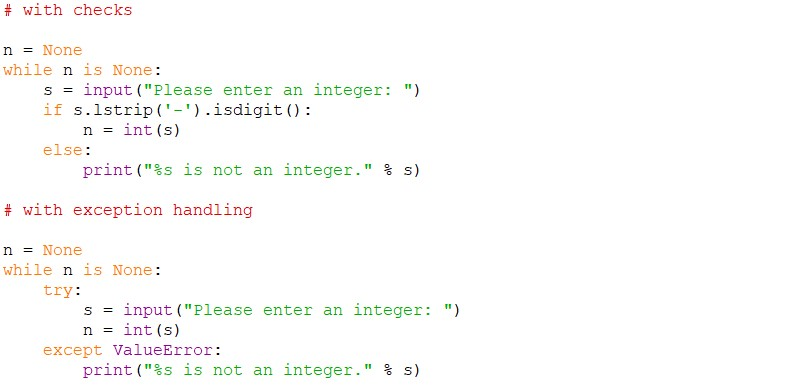

In the first code snippet, we have to write quite a convoluted check to test whether the user’s input is an integer – first we strip off a minus sign if it exists, and then we check if the rest of the string consists only of digits. But there’s a very simple criterion which is also what we really want to know: will this string cause a ValueError if we try to convert it to an integer? In the second snippet we can in effect check for exactly the right condition instead of trying to replicate it ourselves – something which isn’t always easy to do. For example, we could easily have forgotten that integers can be negative, and written the check in the first snippet incorrectly.

## The *else* and *finally* Clause
The try...except block can optionally have an *else clause*, which, when present, must follow all except blocks. The statements in the *else* block is executed only if the try clause does not raise an exception. For example, the codes given below illustrate both the cases. This will help you to visulaize the relevance of the *else* block.

Now, let's take a look at an example to better understand this.

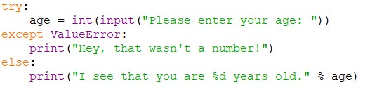

The output of the aforementioned program is given below:

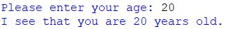

The *try* block has another optional block called finally which is used to define clean-up actions that must be executed under all circumstances. The *finally* block is always executed before leaving the *try* block. This means that the statements written in *finally* block are executed irrespective of whether an exception has occured or not.

Now, let's take a look at an example to better understand this.

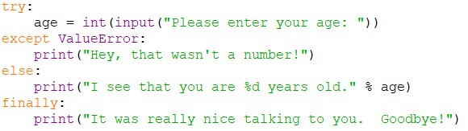

The output of the aforementioned program is given below:

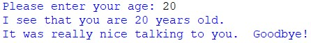

## Built-in and User-defined Exceptions
The following table lists some standard exceptions that are already defined in Python. These built-in exceptions force your program to output an error when something in it goes wrong.

|       Exception      |                                              Description                                                | 
|----------------------|---------------------------------------------------------------------------------------------------------|
| Exception            | Base class for all exceptions                                                                           | 
| StopIteration        | Generated when the next() method of an iteratordoes not point to any object                             |
| SystemExit           | Raised by sys.exit() function                                                                           |
| StandardError        | Base class for all built-in exceptions                                                                  |
| ArithmeticError      | Base class for errors that are generated due to mathematical calculations                               |
| OverflowError        | Raised when the maximum limit of a numeric type is exceeded during a calculation                        |
| FloatingPointError   | Raised when a floating point calculation could not be performed                                         |
| ZeroDivisionError    | Raised when a number is divided by zero                                                                 |
| AssertionError       | Raised when the assert statement fails                                                                  |
| AttributeError       | Raised when attribute reference or assignment fails                                                     |
| EOFError             | Raised when end-of-file is reached or there is no input for input() function                            |
| ImportError          | Raised when an import statement fails                                                                   |
| KeyboardInterrupt    | Raised when the user interupts program execution (by pressing Ctrl+C)                                   |
| LookupError          | Base class for all lookup errors                                                                        |
| IndexError           | Raised when an index is not found in a sequence                                                         |
| KeyError             | Raised when a key is not found in the dictionary                                                        |
| NameError            | Raised when an identifier is not found in local or global namespace                                     |
| UnboundLocalerror    | Raised when an attempt to access a local variable in function or method when no value is asigned to it  |
| IOError              | Raised when input or output operation fails                                                             |
| SyntaxError          | Raised when there is a syntax error in the program                                                      |
| IndentaionError      | Raised when there is an indentation problem in the program                                              |
| SystemError          | Raised when an internal system error occurs                                                             |
| ValueError           | Raised when the arguments passed to a function are of invalid types or searching for non-existing value |
| RuntimeError         | Raised when the generated error does not fall into any of the above category                            |
| NotImplementedError  | Raised when an abstract method that needs to be implemented in an inherited class is not implemented    |
| TypeError            | Raised when two or more data types are mixed without coercion                                           |

Besides these, Python allows programmers to create their own exceptions by creating a new exception class. The new exception class is derived from the base class *Exception* which is pre-defined in Python. The program given below explains this concept.

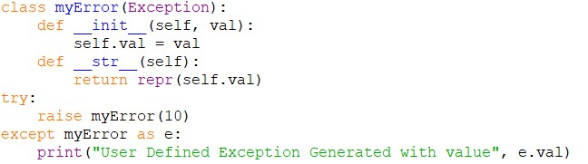

The output of the aforementioned program is given below:

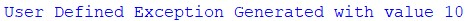

##Author
- Divyankar Bhargav - [Github](https://github.com/ScaryWings83289), [Linkedin](https://www.linkedin.com/in/divyankar-bhargav-a4b487196/), [Instagram](https://www.instagram.com/divyankarbhargav/)

##Acknowledgements
- DevIncept Mentor
- Stackoverflow
- GeeksforGeeks
- Python Programming(By Reema Thareja)

