# Introduction to Pandas
Pandas is an open-source library that is made mainly for working with relational or labeled data both easily and intuitively. It provides various data structures and operations for manipulating numerical data and time series. This library is built on the top of the NumPy library. Pandas is fast and it has high-performance & productivity for users.
Python with Pandas is used in a wide range of fields including academic and commercial domains including finance, economics, Statistics, analytics, etc.

## Key Features of Pandas
* Fast and efficient DataFrame object with default and customized indexing.
* Tools for loading data into in-memory data objects from different file formats.
* Data alignment and integrated handling of missing data.
* Data alignment and integrated handling of missing data.
* Label-based slicing, indexing and subsetting of large data sets.
* Columns from a data structure can be deleted or inserted.
* Group by data for aggregation and transformations.
* High performance merging and joining of data.
* Time Series functionality.

## How to Install Python Pandas on Windows and Linux?
Pandas programs can be written on any plain text editor like notepad, notepad++, or anything of that sort and saved with a .py extension. To begin with, writing Pandas Codes and performing various intriguing and useful operations, one must have Python installed on their System. This can be done by following the step by step instructions provided below:

### What if Python already exists? Let’s check
To check if your device is pre-installed with Python or not, just go to the Command line.
Now run the following command:
```python
python --version
```
If Python is already installed, it will generate a message with the Python version available.


To install Python, please visit: **How to Install Python on [Windows](https://www.geeksforgeeks.org/how-to-install-python-on-windows/) or [Linux](https://www.geeksforgeeks.org/how-to-install-python-on-linux/)**

### Downloading & Installling Pandas
Pandas can be installed in multiple ways on Windows and on Linux. Various different ways are listed below:<br>
<p align="center">
    <b>Windows</b>
</p>
Python Pandas can be installed on Windows in two ways:<br>
* Using Pip<br>
* Using Anaconda <br><br>

**Install Pandas using pip**<br>
PIP is a package management system used to install and manage software packages/libraries written in Python. These files are stored in a large “on-line repository” termed as Python Package Index (PyPI).
Pandas can be installed using PIP by the use of the following command:
```python
pip install pandas
```


**Install Pandas using Anaconda**<br>
Anaconda is open-source software that contains Jupyter, spyder, etc that are used for large data processing, data analytics, heavy scientific computing. If your system is not pre-equipped with Anaconda Navigator, you can learn **how to install Anaconda Navigator on [Windows](https://www.geeksforgeeks.org/how-to-install-anaconda-on-windows/) or [Linux](https://www.geeksforgeeks.org/how-to-install-anaconda-on-linux/)**

**Steps to Install Pandas using Anaconda Navigator:**<br>

**Step 1:** Search for **Anaconda Navigator** in Start Menu and open it.<br>
**Step 2:** Click on the **Environment tab** and then click on the **create** button to create a new Pandas Environment.<br>
**Step 3:** Give a name to your Environment, e.g. Pandas and then choose a python version to run in the environment. Now click on the **Create** button to create Pandas Environment.<br>
**Step 4:** Now click on the **Pandas Environment** created to activate it.<br>
**Step 5:** In the list above package names, select **All** to filter all the packages.<br>
**Step 6:** Now in the Search Bar, look for **‘Pandas‘**. Select the **Pandas package** for Installation.<br>
**Step 7:** Now Right Click on the checkbox given before the name of the package and then go to **‘Mark for specific version installation‘**. Now select the version that you want to install.<br>
**Step 8:** Click on the **Apply** button to install the Pandas Package.<br>
**Step 9:**  Finish the Installation process by clicking on the **Apply** button.<br>
**Step 10:** Now to open the Pandas Environment, click on the **Green** Arrow on the right of package name and select the Console with which you want to begin your Pandas programming.<br>
<p align="center">
    <b>Linux</b>
</p>
To install Pandas on Linux, just type the following command in the Terminal Window and press Enter. Linux will automatically download and install the packages and files required to run Pandas Environment in Python:


## Pandas Dataframe
Pandas DataFrame is two-dimensional size-mutable, potentially heterogeneous tabular data structure with labeled axes (rows and columns). A Data frame is a two-dimensional data structure, i.e., data is aligned in a tabular fashion in rows and columns. Pandas DataFrame consists of three principal components, the data, rows, and columns.

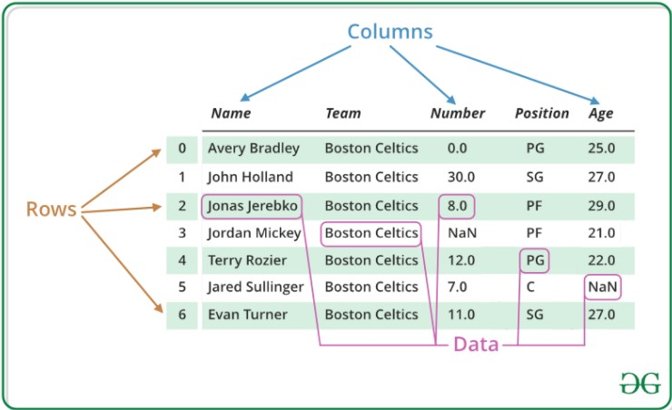

We will get a brief insight on all these basic operation which can be performed on Pandas DataFrame :
* Creating a DataFrame
* Dealing with Rows and Columns
* Indexing and Selecting Data
* Working with Missing Data
* Iterating over rows and columns

### Creating a Pandas DataFrame
In the real world, a Pandas DataFrame will be created by loading the datasets from existing storage, storage can be SQL Database, CSV file, and Excel file. Pandas DataFrame can be created from the lists, dictionary, and from a list of dictionary etc. Dataframe can be created in different ways here are some ways by which we create a dataframe:<br>

**Creating a dataframe using List:**  DataFrame can be created using a single list or a list of lists.
```python
# import pandas as pd
import pandas as pd
 
# list of strings
lst = ['Geeks', 'For', 'Geeks', 'is', 'portal', 'for', 'Geeks']
 
# Calling DataFrame constructor on list
df = pd.DataFrame(lst)
print(df)
```

**Output**

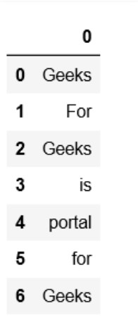

**Creating DataFrame from dict of narray/lists:** To create DataFrame from dict of narray/list, all the narray must be of same length. If index is passed then the length index should be equal to the length of arrays. If no index is passed, then by default, index will be range(n) where n is the array length.
```python
# Python code demonstrate creating 
# DataFrame from dict narray / lists 
# By default addresses.
 
import pandas as pd
 
# intialise data of lists.
data = {'Name':['Tom', 'nick', 'krish', 'jack'], 'Age':[20, 21, 19, 18]}
 
# Create DataFrame
df = pd.DataFrame(data)
 
# Print the output.
print(df)
```

**Output**

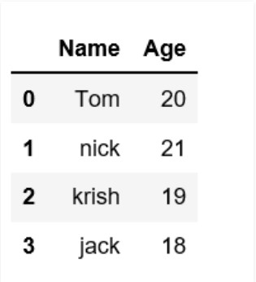

### Dealing with Rows and Columns
A Data frame is a two-dimensional data structure, i.e., data is aligned in a tabular fashion in rows and columns. We can perform basic operations on rows/columns like selecting, deleting, adding, and renaming.<br>

**Column Selection:** In Order to select a column in Pandas DataFrame, we can either access the columns by calling them by their columns name.
```python
# Import pandas package
import pandas as pd
 
# Define a dictionary containing employee data
data = {'Name':['Jai', 'Princi', 'Gaurav', 'Anuj'], 'Age':[27, 24, 22, 32], 'Address':['Delhi', 'Kanpur', 'Allahabad', 'Kannauj'],
        'Qualification':['Msc', 'MA', 'MCA', 'Phd']}
 
# Convert the dictionary into DataFrame 
df = pd.DataFrame(data)
 
# select two columns
print(df[['Name', 'Qualification']])
```

**Output**

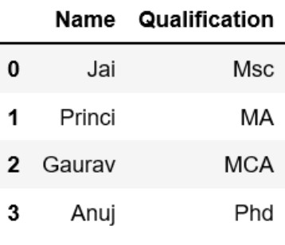

**Row Selection:** Pandas provide a unique method to retrieve rows from a Data frame. DataFrame.loc[] method is used to retrieve rows from Pandas DataFrame. Rows can also be selected by passing integer location to an iloc[] function.
```python
# importing pandas package
import pandas as pd
 
# making data frame from csv file
data = pd.read_csv("nba.csv", index_col ="Name")
 
# retrieving row by loc method
first = data.loc["Avery Bradley"]
second = data.loc["R.J. Hunter"]
 
print(first, "\n\n\n", second)
```

**Output**


### Indexing and Selecting Data
Indexing in pandas means simply selecting particular rows and columns of data from a DataFrame. Indexing could mean selecting all the rows and some of the columns, some of the rows and all of the columns, or some of each of the rows and columns. Indexing can also be known as Subset Selection.<br>

**Indexing a Dataframe using indexing operator [] :**<br>
Indexing operator is used to refer to the square brackets following an object. The .loc and .iloc indexers also use the indexing operator to make selections. In this indexing operator to refer to df[].<br>
**Selecting a single columns:** In order to select a single column, we simply put the name of the column in-between the brackets
```python
# importing pandas package
import pandas as pd
 
# making data frame from csv file
data = pd.read_csv("nba.csv", index_col ="Name")
 
# retrieving columns by indexing operator
first = data["Age"]

print(first)
```

**Output**

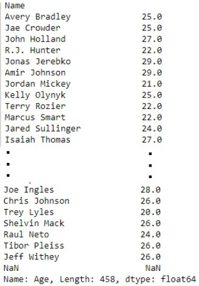

**Indexing a DataFrame using .loc[ ] :**<br>
This function selects data by the label of the rows and columns. The df.loc indexer selects data in a different way than just the indexing operator. It can select subsets of rows or columns. It can also simultaneously select subsets of rows and columns.<br>
**Selecting a single row:** In order to select a single row using .loc[], we put a single row label in a .loc function.
```python
# importing pandas package
import pandas as pd
 
# making data frame from csv file
data = pd.read_csv("nba.csv", index_col ="Name")
 
# retrieving row by loc method
first = data.loc["Avery Bradley"]
second = data.loc["R.J. Hunter"]
 
print(first, "\n\n\n", second)
```

**Output**<br>
As shown in the output image, two series were returned since there was only one parameter both of the times.

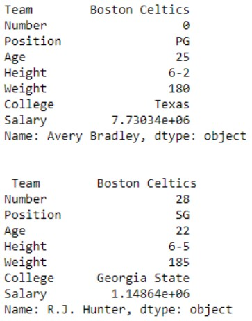

**Indexing a DataFrame using .iloc[ ] :**<br>
This function allows us to retrieve rows and columns by position. In order to do that, we’ll need to specify the positions of the rows that we want, and the positions of the columns that we want as well. The df.iloc indexer is very similar to df.loc but only uses integer locations to make its selections.<br>
**Selecting a single row:** In order to select a single row using .iloc[], we can pass a single integer to .iloc[] function.
```python
import pandas as pd
 
# making data frame from csv file
data = pd.read_csv("nba.csv", index_col ="Name")
 
# retrieving rows by iloc method 
row2 = data.iloc[3] 
 
print(row2)
```

**Output**

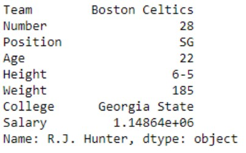

### Working with Missing Data
Missing Data can occur when no information is provided for one or more items or for a whole unit. Missing Data is a very big problem in real life scenario. Missing Data can also refer to as NA(Not Available) values in pandas.<br>
**Checking for missing values using isnull() and notnull() :** In order to check missing values in Pandas DataFrame, we use a function isnull() and notnull(). Both function help in checking whether a value is NaN or not. These function can also be used in Pandas Series in order to find null values in a series.
```python
# importing pandas as pd
import pandas as pd
 
# importing numpy as np
import numpy as np
 
# dictionary of lists
dict = {'First Score':[100, 90, np.nan, 95], 'Second Score': [30, 45, 56, np.nan], 'Third Score':[np.nan, 40, 80, 98]}
 
# creating a dataframe from list
df = pd.DataFrame(dict)
 
# using isnull() function  
df.isnull()
```

**Output**

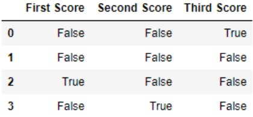

**Filling missing values using fillna(), replace() and interpolate() :** In order to fill null values in a datasets, we use fillna(), replace() and interpolate() function these function replace NaN values with some value of their own. All these function help in filling a null values in datasets of a DataFrame. Interpolate() function is basically used to fill NA values in the dataframe but it uses various interpolation technique to fill the missing values rather than hard-coding the value.
```python
# importing pandas as pd
import pandas as pd
 
# importing numpy as np
import numpy as np
 
# dictionary of lists
dict = {'First Score':[100, 90, np.nan, 95], 'Second Score': [30, 45, 56, np.nan], 'Third Score':[np.nan, 40, 80, 98]}
 
# creating a dataframe from dictionary
df = pd.DataFrame(dict)
 
# filling missing value using fillna()  
df.fillna(0)
```

**Output**

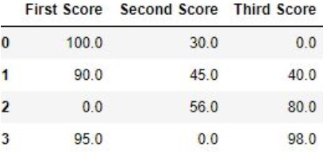

**Dropping missing values using dropna() :** In order to drop a null values from a dataframe, we used dropna() function this fuction drop Rows/Columns of datasets with Null values in different ways.
```python
# importing pandas as pd
import pandas as pd
 
# importing numpy as np
import numpy as np
 
# dictionary of lists
dict = {'First Score':[100, 90, np.nan, 95], 'Second Score': [30, np.nan, 45, 56], 'Third Score':[52, 40, 80, 98], 'Fourth Score':[np.nan, np.nan, np.nan, 65]}
 
# creating a dataframe from dictionary
df = pd.DataFrame(dict)

# using dropna() function 
df.dropna()
```

**Output**

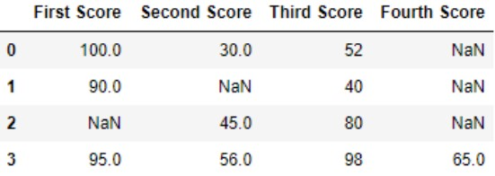

### Iterating over rows and columns
Iteration is a general term for taking each item of something, one after another. Pandas DataFrame consists of rows and columns so, in order to iterate over dataframe, we have to iterate a dataframe like a dictionary.<br>

**Iterating over rows :** In order to iterate over rows, we can use three function iteritems(), iterrows(), itertuples() . These three function will help in iteration over rows.
```python
# importing pandas as pd
import pandas as pd
  
# dictionary of lists
dict = {'name':["aparna", "pankaj", "sudhir", "Geeku"], 'degree': ["MBA", "BCA", "M.Tech", "MBA"], 'score':[90, 40, 80, 98]}
 
# creating a dataframe from a dictionary 
df = pd.DataFrame(dict)
 
print(df)
```

**Output**

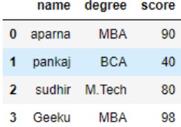

**Iterating over Columns :** In order to iterate over columns, we need to create a list of dataframe columns and then iterating through that list to pull out the dataframe columns.
```python
# importing pandas as pd
import pandas as pd
   
# dictionary of lists
dict = {'name':["aparna", "pankaj", "sudhir", "Geeku"], 'degree': ["MBA", "BCA", "M.Tech", "MBA"], 'score':[90, 40, 80, 98]}
  
# creating a dataframe from a dictionary 
df = pd.DataFrame(dict)
 
print(df)
```

**Output**

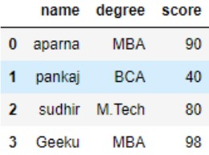

## Pandas Series
Pandas Series is a one-dimensional labeled array capable of holding data of any type (integer, string, float, python objects). The axis labels are collectively called index. Pandas Series is nothing but a column in an excel sheet.
Labels need not be unique but must be a hashable type. The object supports both integer and label-based indexing and provides a host of methods for performing operations involving the index.

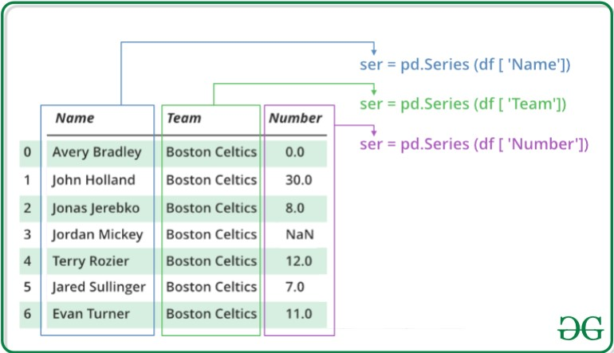

We will get a brief insight on all these basic operations which can be performed on Pandas Series :
* Creating a Series
* Accessing element of Series
* Indexing and Selecting Data in Series
* Binary operation on Series
* Conversion Operation on Series

### Creating a Pandas Series
In the real world, a Pandas Series will be created by loading the datasets from existing storage, storage can be SQL Database, CSV file, and Excel file. Pandas Series can be created from the lists, dictionary, and from a scalar value etc. Series can be created in different ways, here are some ways by which we create a series:<br>

**Creating a series from array:** In order to create a series from array, we have to import a numpy module and have to use array() function.
```python
# import pandas as pd
import pandas as pd
 
# import numpy as np
import numpy as np
 
# simple array
data = np.array(['g','e','e','k','s'])
 
ser = pd.Series(data)
print(ser)
```

**Output**

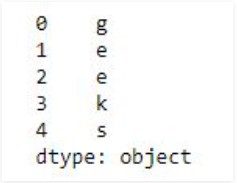

**Creating a series from Lists:** In order to create a series from list, we have to first create a list after that we can create a series from list.
```python
import pandas as pd
 
# a simple list
list = ['g', 'e', 'e', 'k', 's']
  
# create series form a list
ser = pd.Series(list)
print(ser)
```

**Output**


### Accessing element of Series
There are two ways through which we can access element of series, they are :
* Accessing Element from Series with Position
* Accessing Element Using Label (index)

**Accessing Element from Series with Position :** In order to access the series element refers to the index number. Use the index operator [ ] to access an element in a series. The index must be an integer. In order to access multiple elements from a series, we use Slice operation.<br>
Accessing first 5 elements of Series
```python
# import pandas and numpy 
import pandas as pd
import numpy as np
 
# creating simple array
data = np.array(['g', 'e', 'e', 'k', 's', 'f', 'o', 'r', 'g', 'e', 'e', 'k', 's'])
ser = pd.Series(data)
  
#retrieve the first element
print(ser[:5])
```

**Output**


**Accessing Element Using Label (index) :** In order to access an element from series, we have to set values by index label. A Series is like a fixed-size dictionary in that you can get and set values by index label.<br>
Accessing a single element using index label
```python
# import pandas and numpy 
import pandas as pd
import numpy as np
 
# creating simple array
data = np.array(['g', 'e', 'e', 'k', 's', 'f', 'o', 'r', 'g', 'e', 'e', 'k', 's'])
ser = pd.Series(data,index=[10, 11, 12, 13, 14, 15, 16, 17, 18, 19, 20, 21, 22])
  
# accessing a element using index element
print(ser[16])
```

**Output**


### Indexing and Selecting Data in Series
Indexing in pandas means simply selecting particular data from a Series. Indexing could mean selecting all the data, some of the data from particular columns. Indexing can also be known as Subset Selection.<br>

**Indexing a Series using indexing operator [] :** Indexing operator is used to refer to the square brackets following an object. The .loc and .iloc indexers also use the indexing operator to make selections. In this indexing operator to refer to df[ ].
```python
# importing pandas module  
import pandas as pd  
     
# making data frame  
df = pd.read_csv("nba.csv")  
   
ser = pd.Series(df['Name']) 
data = ser.head(10)
data 
```

**Output**

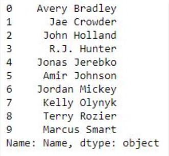

**Indexing a Series using .loc[ ] :** This function selects data by refering the explicit index . The df.loc indexer selects data in a different way than just the indexing operator. It can select subsets of data.
```python
# importing pandas module  
import pandas as pd  
     
# making data frame  
df = pd.read_csv("nba.csv")  
   
ser = pd.Series(df['Name']) 
data = ser.head(10)
data 
```

**Output**

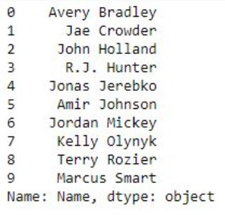

**Indexing a Series using .iloc[ ] :** This function allows us to retrieve data by position. In order to do that, we’ll need to specify the positions of the data that we want. The df.iloc indexer is very similar to df.loc but only uses integer locations to make its selections.
```python
# importing pandas module  
import pandas as pd  
     
# making data frame  
df = pd.read_csv("nba.csv")  
   
ser = pd.Series(df['Name']) 
data = ser.head(10)
data 
```

**Output**


### Binary Operation on Series
We can perform binary operation on series like addition, subtraction and many other operation. In order to perform binary operation on series we have to use some function like .add(),.sub() etc.
```python
# importing pandas module  
import pandas as pd  
 
# creating a series
data = pd.Series([5, 2, 3,7], index=['a', 'b', 'c', 'd'])
 
# creating a series
data1 = pd.Series([1, 6, 4, 9], index=['a', 'b', 'd', 'e'])
 
print(data, "\n\n", data1)
```

**Output**

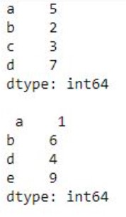

### Conversion Operation on Series
In conversion operation we perform various operation like changing datatype of series, changing a series to list etc. In order to perform conversion operation we have various function which help in conversion like .astype(), .tolist() etc.
```python
# importing pandas module  
import pandas as pd 
   
# reading csv file from url  
data = pd.read_csv("nba.csv") 
    
# dropping null value columns to avoid errors 
data.dropna(inplace = True) 
   
# storing dtype before converting 
before = data.dtypes 
   
# converting dtypes using astype 
data["Salary"]= data["Salary"].astype(int) 
data["Number"]= data["Number"].astype(str) 
   
# storing dtype after converting 
after = data.dtypes 
   
# printing to compare 
print("BEFORE CONVERSION\n", before, "\n") 
print("AFTER CONVERSION\n", after, "\n") 
```

**Output**

