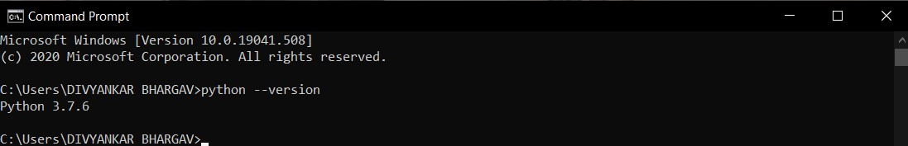

# Introduction to Pandas
Pandas is an open-source library that is made mainly for working with relational or labeled data both easily and intuitively. It provides various data structures and operations for manipulating numerical data and time series. This library is built on the top of the NumPy library. Pandas is fast and it has high-performance & productivity for users.
Python with Pandas is used in a wide range of fields including academic and commercial domains including finance, economics, Statistics, analytics, etc.

## Key Features of Pandas
* Fast and efficient DataFrame object with default and customized indexing.
* Tools for loading data into in-memory data objects from different file formats.
* Data alignment and integrated handling of missing data.
* Data alignment and integrated handling of missing data.
* Label-based slicing, indexing and subsetting of large data sets.
* Columns from a data structure can be deleted or inserted.
* Group by data for aggregation and transformations.
* High performance merging and joining of data.
* Time Series functionality.

## How to Install Python Pandas on Windows and Linux?
Pandas programs can be written on any plain text editor like notepad, notepad++, or anything of that sort and saved with a .py extension. To begin with, writing Pandas Codes and performing various intriguing and useful operations, one must have Python installed on their System. This can be done by following the step by step instructions provided below:

### What if Python already exists? Let’s check
To check if your device is pre-installed with Python or not, just go to the Command line.
Now run the following command:
```python
python --version
```
If Python is already installed, it will generate a message with the Python version available.



To install Python, please visit: *How to Install Python on [Windows](https://www.geeksforgeeks.org/how-to-install-python-on-windows/) or [Linux](https://www.geeksforgeeks.org/how-to-install-python-on-linux/)*

### Downloading & Installling Pandas

