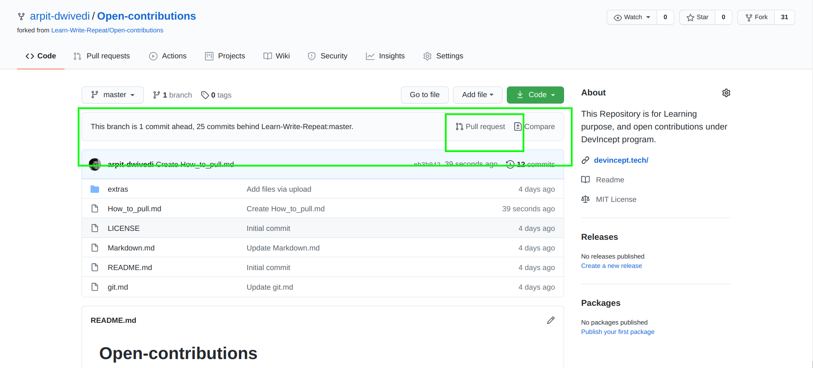

# Follow these steps to Pull Request

1. When you will do any change in forked repository, you will se this in the top, this will tell how many commits ahead you are from master. So click on Pull request.

