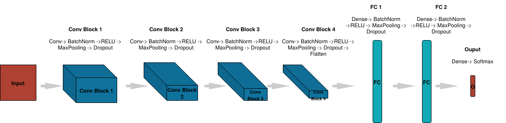
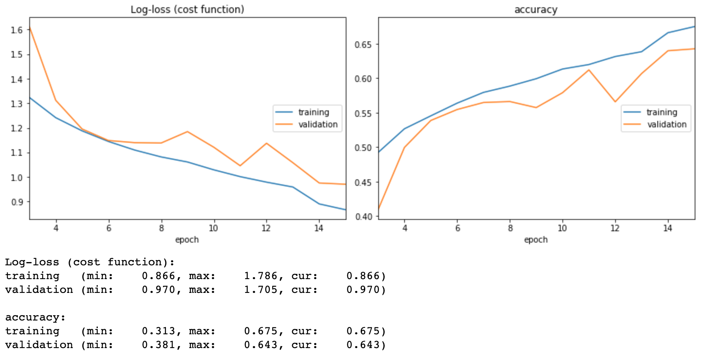
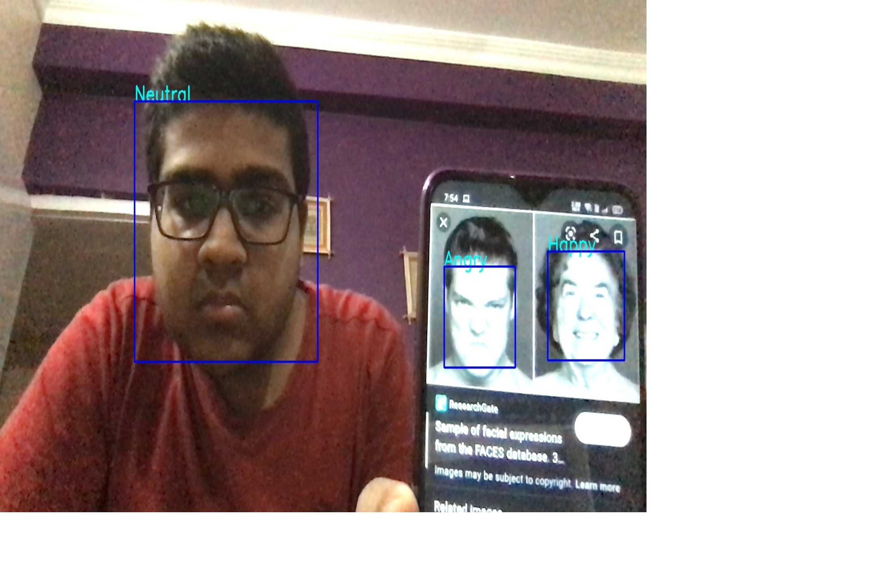
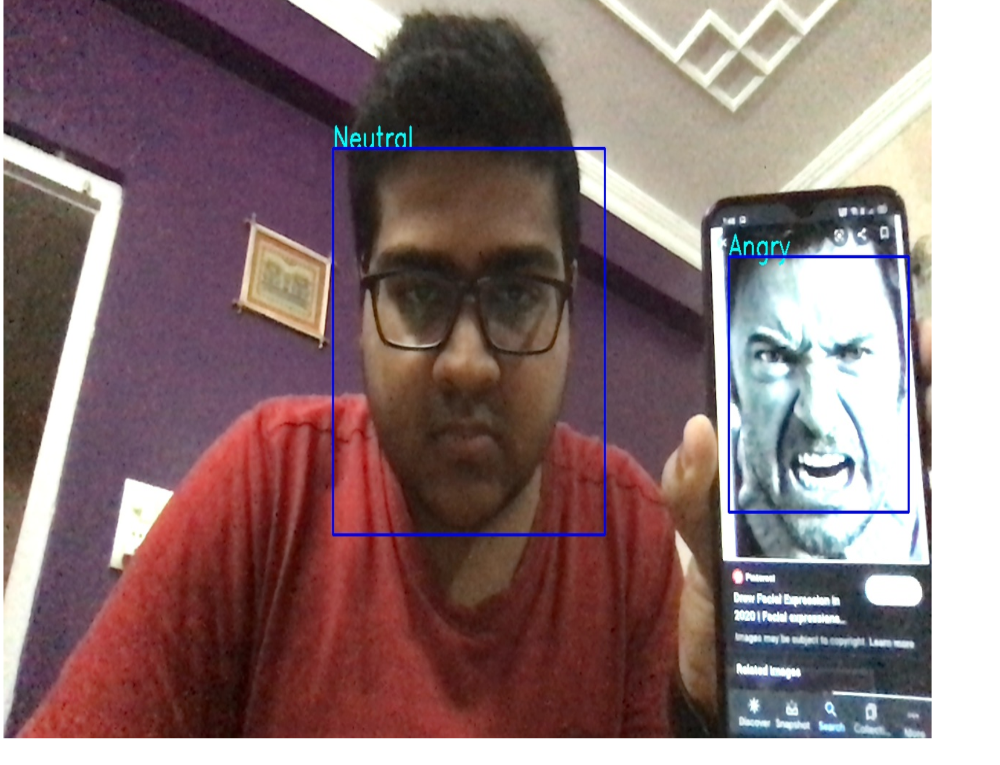
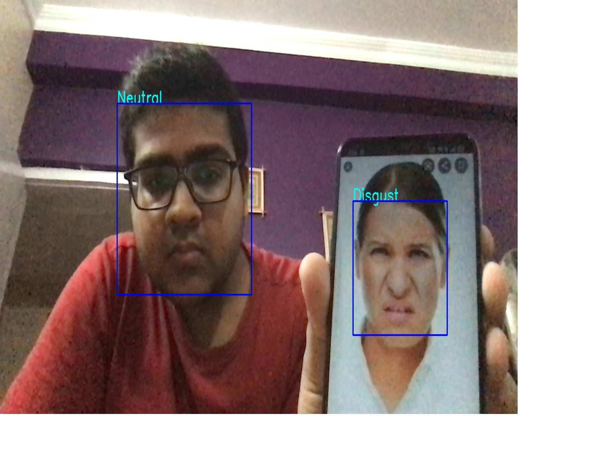
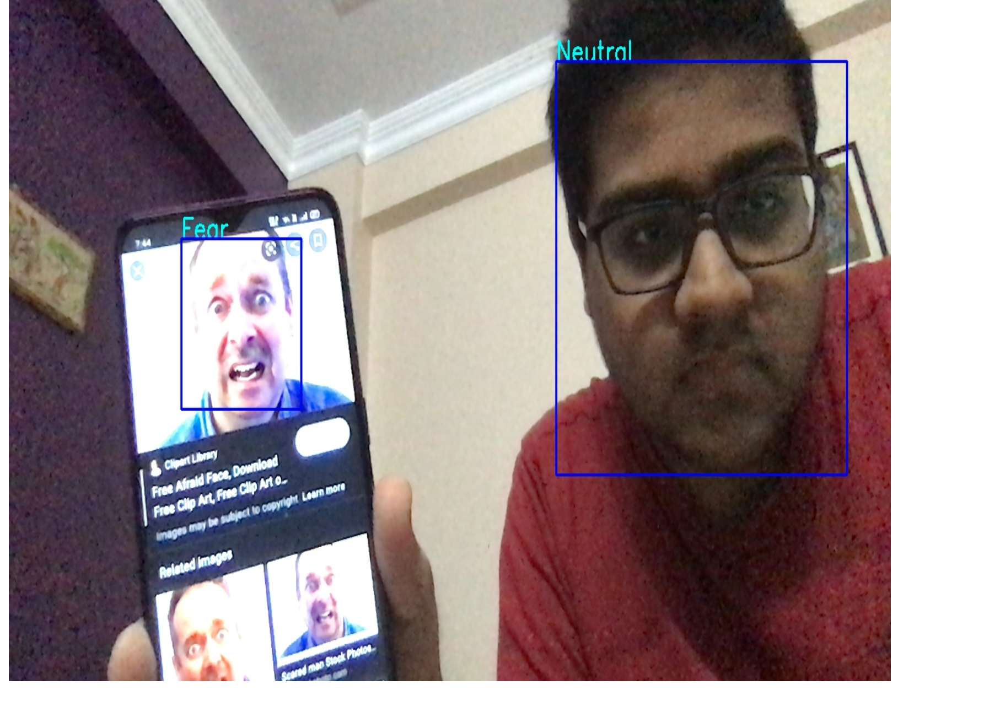
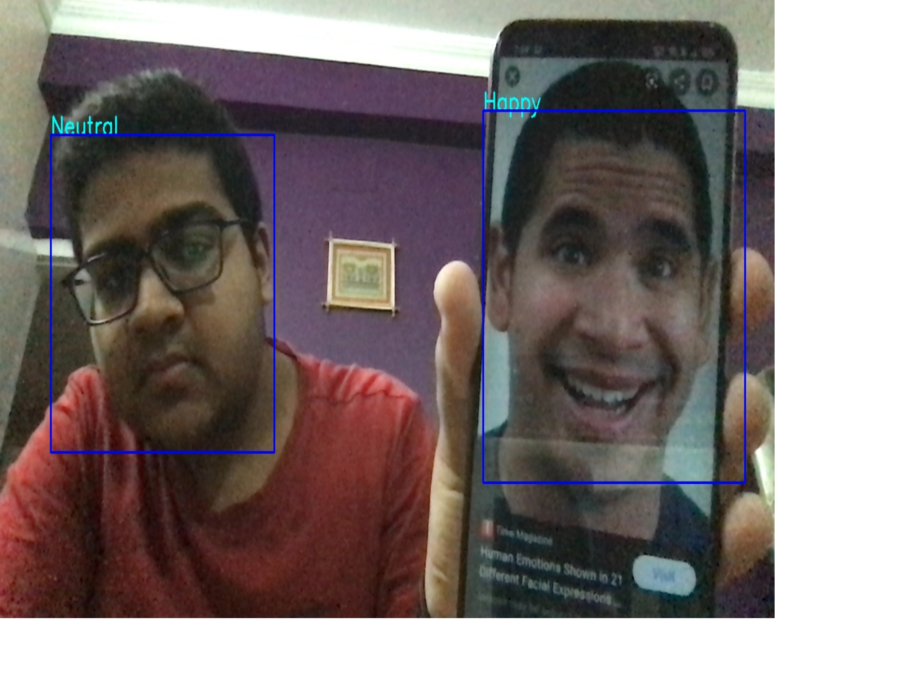
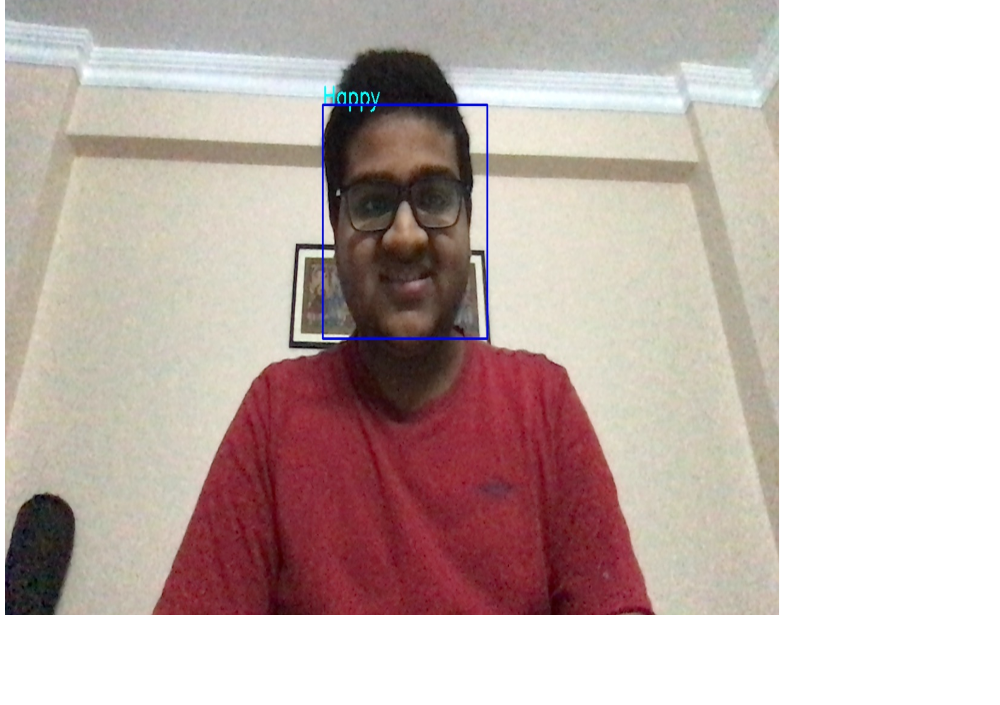
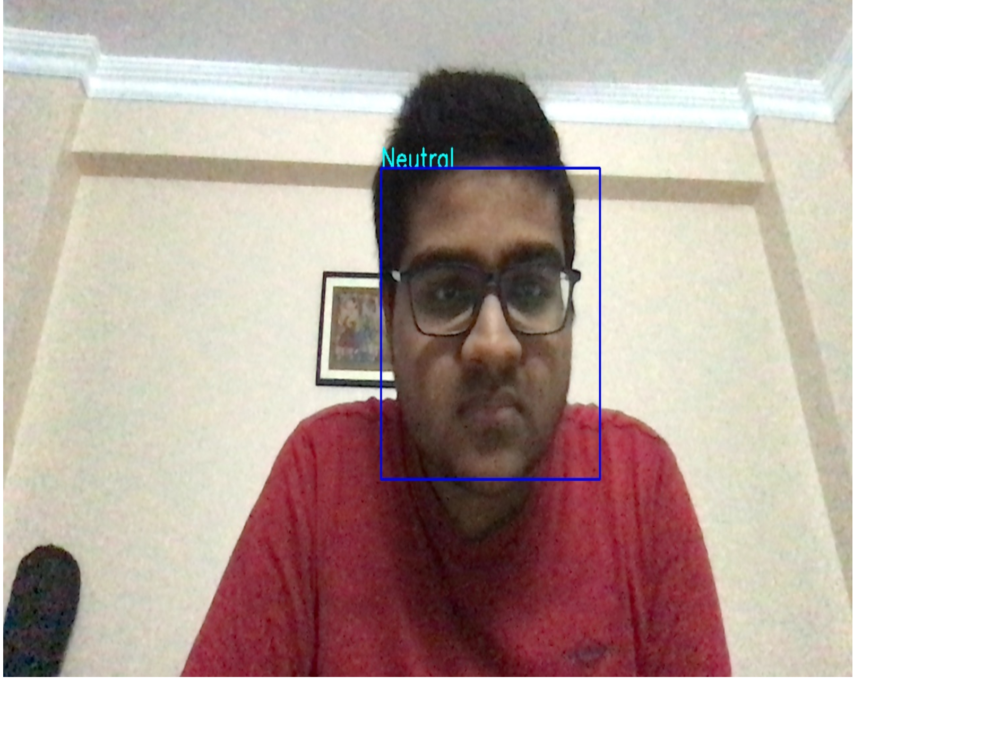

# Facial_Expression_Recognition_OpenCV_Keras
Facial Expression Recognition is an application of Computer Vision, a boon of AI, which enables the computer recognise a person's emotion on the basis of his/her facial expression. Its main applcations are listed below:
## Applications:
<ul>
<li>It can be used to detect the predominant emotion of a person while doing a particular activity like giving a lecture, watching a video, reading a post, etc.</li>
<li>It can be used to find how funny or emotional a particular video, or post, or image is by determing the facial expression of many people.</li>
<li>It can be used to detect mental disorders.</li>
<li>It can help prevent riots by detecting the anger emotion among multiple people.</li>
<li>It help the human users monitor their stress level.</li>
<li>It can help AI assistants to recommend videos or songs or say things according to the emotion of the user, like cheering them when they are sad and sounding happy,when a person is happy. This way, we can create good AI friends and help remove loneliness from people's lives.</li>
</ul>

## Aim of this project:
Training a convolutional neural network to recognise 7 kinds of emotions (Happy, Anger, Sad, Fear, Disgust, Surprise, Neutral) after detection of face in real time video camera and giving the prediction.
## The dataset used for training and testing the model:
It consists of the training (28,709 images) and the testing (7,178 images) set comprising of images of people's faces with the 7 kinds of expressions mentioned above.
The class-distribution of the training set is as follows:
<ol>
  <li>3171 surprise images</li>
  <li>7215 happy images</li>
  <li>4965 neutral images</li>
  <li>3995 angry images</li>
  <li>4830 sad images</li>
  <li>436 disgust images</li>
  <li>4097 fear images</li>
</ol>
 

 
<h2>A brief dicussion of Convolutional Neural Networks:</h2>

In neural networks, Convolutional neural network (ConvNets or CNNs) is one of the main categories for image recognition, image classifications, object detection, face recognition, etc. These are some of the areas where CNNs are widely used. CNN's work on the principle of extracting low-level features in the earlier layers, like edges in the image, to more complex features in the deeper layers using complex mathematical operations (called convolving) on the pixel values of the given image using mathematical entities called filters.

Convolutional Neural Networks have 2 main components:
<ol>
  <li><b>Feature learning:</b> We see convolution, ReLU,Pooling layer phases here. Edges,shades,lines,curves, in this feature learning step get extracted.</li>
  <li><b>Classification:</b> We see Fully Connected(FC) layer in this phase. They will assign a probability for the object on the image according to what our CNN model predicts.</li>
 </ol>
For more detailed information on CNNs refer to this <a href=https://medium.com/@purnasaigudikandula/a-beginner-intro-to-convolutional-neural-networks-684c5620c2ce>link.</a>

<h2>Our model:</h2>

 
This model has ben taken from a <a href=http://cs231n.stanford.edu/reports/2016/pdfs/005_Report.pdf>research paper</a> by Stanford University on finding the best model for facial expression recognition.
 
 
<b>It consists of 4 convolutional blocks, each comprising of:</b>   
<ol>
  <li><b>Convolutional layer</b> of a number of filters (increaing by powers of 2 in each layer) for feature extraction</li>
  <li><b>Batch Normalisation</b> for normalising the inputs fed into the next layer for avoiding covariate shift.</li>
  <li><b>Maxpooling</b> for extracting the most prominent feature in the feature maps produced after applying the convolution operations and reducing the spatial size of the representation to reduce the amount of parameters and computation in the network</li>
  <li><b>Rectified Linear Unit Activation Function</b> for allowing the model to create complex mappings between the network’s inputs and outputs, which are essential for learning and modeling complex data, such as images and data sets like these which are non-linear and have high dimensionality.</li>
  <li><b>Dropout</b> for randomly shutting of some neurons in the layer for avoiding overfitting to the data i.e. to prevent our network from learning the deviations in the training data so well, that the network does not generalise on new, unseen data.</li>
  </ol>
 

The extracted features by the CNN is now passed through <b>two fully connected layers</b> with the same architecture as the convolutional blocks and then a <b>softmax</b> to make the final prediction on the basis of the probabilities of the 7 emotions predicted.

<h2>Loss Functions, Validation Accuracy:</h2>

<b>The graphs of the loss-function and the accuracy vs the epochs for the training and testing set are shown below:</b>

After training for 15 epochs, we can see that we achieve <b>67 % accuracy </b> on the training set and around <b> 64% accuracy </b> on the validation (testing) set. We save the model in a json file and its weights in a .h5 file.
<h2>The model.py script</h2>

This python script utilises the saved model and its weights and outputs the prediction out of the given list of emotions. This script creates a model object and defines its corresponding functions like .predict_emotion in a class called FacialExpressionModel, which will be used by the camera.py python script as described below, to output the model's prediction after detecting the face.

<h2>The camera.py script</h2>
 
We use OpenCV's cv2 library and the haarcascade_frontalface_default.xml file in this to detect the face, grayscale it(since our model only understands grayscale images), put a rectangular box around it and output the corresponding prediction beside the rectangular box. We will use the model we trained through its json file we saved. We will put the the value in cv2.videocapture as 0, so that we can make prediction through webcam in real time video.

<h2>The index.html file</h2>

This enables us to create a webpage to display our video, where we can specify the title, color and other front-end features, to make our user interface better.

<h2>The main.py script</h2>

After we have detected faces using haarcascade and created a webpage to display video, we will integrate these two modules with our server, using flask and display it in our localhost. This is the script that integrates all other files we have created in this project. This will be executed in the terminal to get the final output.

<h1> Some screenshots of the final output in our browser : </h1>

<h1>Conclusion:</h1>
In this readme file, we have learnt:
<ol>
<li>What are convolutional neural networks.</li>
  <li>How do do we create them using tensorflow and keras.</li> 
  <li>How do we apply CNNs for image classification.</li>
  <li>How do we use OpenCV for face detection.</li>
  <li>How we use flask to deply our tensorflow models in form of web applications. </li>
 </ol> 
 
