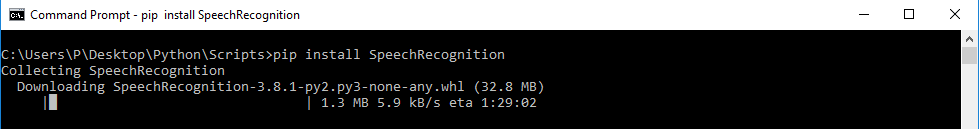

# Python SpeechRecognition (Speech to Text) :sound::ear::speech_balloon:
Have you ever wondered how to add speech recognition to your Python project? If so, then keep reading! It’s easier than you might think.

## Pre-Requisites
* Working knowlwdge of **Python**
* **Python** 2.6, 2.7, or 3.3+ (required):snake:
* **PyAudio** 0.2.11+ (required only if you need to use microphone input, **Microphone**):microphone::headphones:

## **What is Speech Recognition??**
Speech recognition, the ability of devices to respond to spoken commands. Speech recognition enables hands-free control of various devices and equipment (a particular boon to many disabled persons), provides input to automatic translation, and creates print-ready dictation.

**In Simple words:**

**Speech recognition** system basically translates spoken language into text.

## **How Speech Recognition works??**:point_down:
Without all the **Technical Details** in simple words we can say:

The first component of speech recognition is, of course, speech. Speech must be converted from physical sound to an electrical signal with a microphone, and then to digital data with an analog-to-digital converter. Once digitized, several models can be used to transcribe the audio to text.

Most modern speech recognition systems rely on what is known as a [Hidden Markov Model](https://en.wikipedia.org/wiki/Hidden_Markov_model) (HMM). 


## **Python Speech Recognition Packages**
* Google Speech Recognition
* [CMU Sphinx](https://cmusphinx.github.io/wiki/) (works offline)
* [wit](https://pypi.org/project/wit/)
* [watson-developer-cloud](https://pypi.org/project/watson-developer-cloud/)
* [google-cloud-speech](https://pypi.org/project/google-cloud-speech/)

There is one package that stands out in terms of ease-of-use and we are gonna use this package: **SpeechRecognition**.

## **Installing the Required Packages**
### 1. **You can install SpeechRecognition from a terminal with pip:**
```python
   pip install SpeechRecognition
```


**OR** You can download the package  and extract it in the required folder --->> [Download](https://pypi.org/project/SpeechRecognition/#files) 

**Once installed, you should verify the installation by opening an interpreter session and typing:**
```python
   >>> import speech_recognition as sr
   >>> sr.__version__
       '3.8.1'
```


### 2. Installin 
