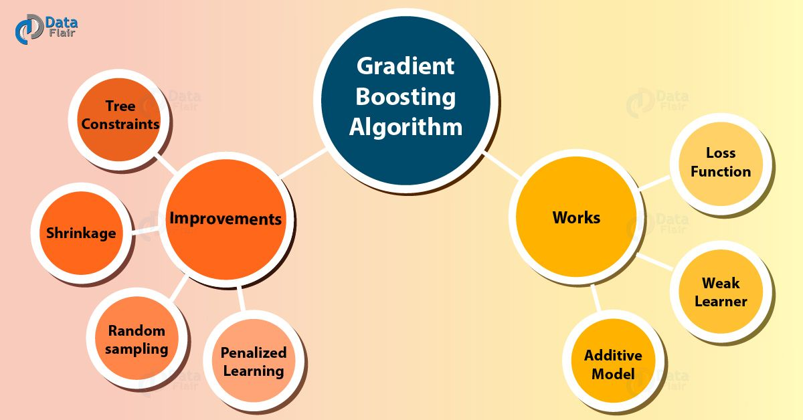

# <ins>XGBoost</ins>

### What are Boosting Algorithms?

   - The term 'Boosting' refers to a family of algorithms which converts weak learner to strong learners.

There are different boosting algorithms in Machine Learning. These algorithms dramatically improve performance from the traditional algorithms like Logistic Regression, Naive Bayes Classifier, Support Vector machines(SVM) etc.

Boosting algorithms are fast , more efficient in dealing with data that takes a lot of time to be trained in some other models like Decision Trees.

The main boosting algorithms are :

1. Adaboost(Adaptive Boosting)
2. Gradient Boost
3. XGBoost (Extreme Gradient Boosting)
4. Light Gradient Boost (LGBM)
5. CatBoost

**For this topic, Let's understand about XGBoost.**

### What is XGBoost?

XGBoost is a state of the art machine learning algorithm that is based upon a tree based approach and uses the [Gradient Boosting](https://en.wikipedia.org/wiki/Gradient_boosting) framework. It mainly performs well for medium datasets (structured/tabular data).
        
XGBoost algorithm was developed as a research project at the University of Washington. Tianqi Chen and Carlos Guestrin presented their paper at SIGKDD Conference in 2016 and caught the Machine Learning world by fire. Since its introduction, this algorithm has not only been credited with winning numerous Kaggle competitions but also for being the driving force under the hood for several cutting-edge industry applications. As a result, there is a strong community of data scientists contributing to the XGBoost open source projects

Now a days, XGBoost is a secret of winning Data Science competitions. 

### Why XGBoost is different from others?

XGBoost improves upon the base GBM framework through various optimizations and enhancements.

#### Features:
 - It has a wide range of applications.
 - It can be run seamlessly in any Operating system.
 - Supports a lot of programming languages like Python, R, Scala etc.
 - It also support Cloud based services like Amazon Web Services (AWS), Microsoft Azure etc.
 - It is blazing fast and hence more efficient.
 - It helps in ranking the most important features used to train the model.
 

 
#### Advantages:

XGBoost is an easy to use algorithm which delivers high performance and accuracy as compared to other algorithms.

 - **Regularization:**
     - XGBoost has in-built L1 (Lasso Regression) and L2 (Ridge Regression) regularization which prevents the model from overfitting. That is why, XGBoost is also called regularized form of GBM (Gradient Boosting Machine).
     The main difference between L1 and L2 regularization(also known as L1 and L2 norm) is the penalty term. Click [here](https://towardsdatascience.com/l1-and-l2-regularization-methods-ce25e7fc831c) to know more about L1 and L2 norm.

 - **Parallel Processing:**
     - It utilizes the power of parallel processing and so it is so much faster and efficient than GBM. It uses multiple CPU cores to execute the model.

 - **Handling Missing Values:**
     - XGBoost has an in-built capability to handle missing values. When XGBoost encounters a missing value at a node, it tries both the left and right hand split and learns the way leading to higher loss for each node. It then does the same when working on the testing data.
     
     
 - **Cross Validation:**
     - XGBoost allows user to run a cross-validation at each iteration of the boosting process and thus it is easy to get the exact optimum number of boosting iterations in a single run. Know more about cross-validation from [here](https://machinelearningmastery.com/k-fold-cross-validation/#:~:text=Cross%2Dvalidation%20is%20a%20resampling,k%2Dfold%20cross%2Dvalidation.).
     

 - **Effective Tree Pruning:**
     - XGBoost make splits upto the max_depth specified and then start pruning (reducing the size of decision trees by removing parts of the tree that do not provide power to classify instances) the tree backwards and remove splits beyond which there is no positive gain.

#### Hyper-Parameters:

XGBoost offers a wide variety of hyper-parameters, that when tuned properly can make a huge difference in performance.

Some of the important paramters are:

Get a detailed view of the Hyper-Parameters for Xgboost from the Creators in their original [documentation](https://xgboost.readthedocs.io/en/latest/parameter.html).

**To install XGBoost in your system**

Simply type the below code for in your command prompt or in anaconda-prompt(If you are using a Anaconda environment),
    
    pip install xgboost
    
**Note:** If you don't have pip installed, refer to [this](https://www.liquidweb.com/kb/install-pip-windows/).

### Conclusion:

With rapid advancements in machine learning, there are several alternatives to XGBoost already.

Microsoft Research recently released LightGBM framework for gradient boosting that shows great potential.

CatBoost developed by Yandex Technology has been delivering impressive bench-marking results. 

It is only a matter of time when we have a better model framework that beats XGBoost in terms of prediction performance, flexibility and explanability.

Refer to this [notebook](https://github.com/PritamAich/Open-contributions/blob/master/Pritam_ML_Xgboost.ipynb) for more understanding on how to implement this algorithm.

 - By Pritam Aich
 
 **Connect With me at : **
 
 [Github](https://github.com/PritamAich) | [LinkedIn](https://www.linkedin.com/in/pritam-aich-05b7551b4/)

