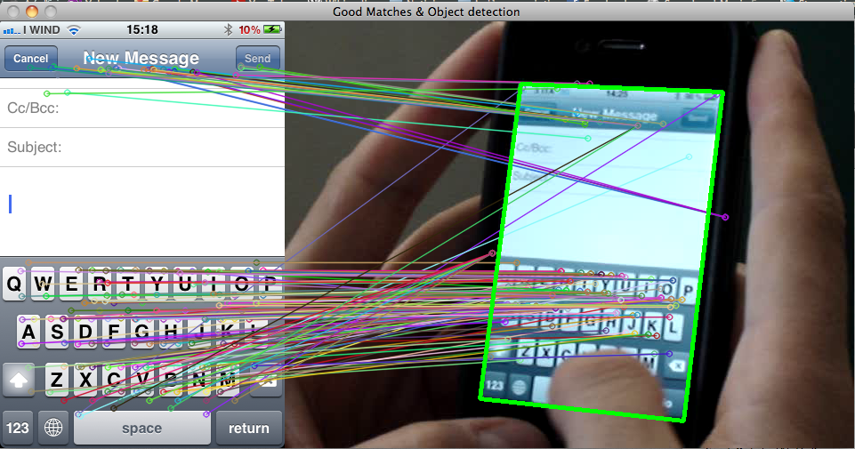
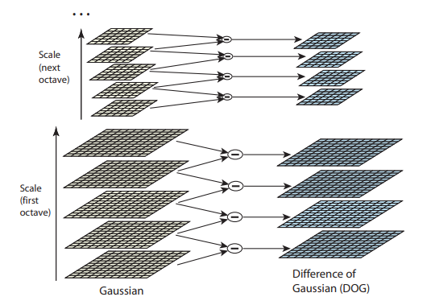
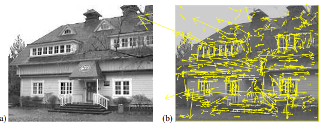
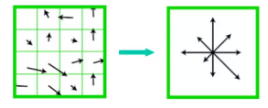
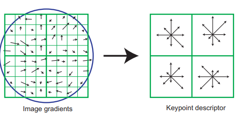

# Scale Invariant Feature Transform (SIFT) 

As stated SHIFT stands for Scale Invariant Feature Transform. This algorithm is patented by David Lowe, University of British Columbia in 2004. Before this algorithm, there were many detectors like corner detector, eg. Harris. But those detector were rotation- inavriant, but not scale invariant. SIFT algorithm changed the whole scenario by being both rotation and scale invariant. To use this algorithm commericially, one needs to pay for it as it is patented.  

## To give you the Basic idea of SIFT with an image-:

## Some Key-points for feature extraction-:
The computational cost is reduced by applying some operations on loactions that pass the initial tests

- ### Scale space peak selection -
  It selects the potential locations to find the feature. Basically we find the [interest points][interest_point] that are invariant to rotation and scaling. To explain the mathematical part, the image is convolved with the [Gaussian Function][gaussian] and octave of diferent scales are formed, the Difference of Gaussian of each octave is taken. Low gave some general value for number of scale and value of sigma.

  This image from Low's paper gives a small discription

  

- ### Key Point Localization -
  This step includes accurately locating the feature key points. Here the candidates are chosen from the extrema detection. There are few mathematical concepts used in this procedure because such steps could have some error in detection and to solve those error one need to apply come threshold to it. So, some mathematical aspects used here are [Hessian matrix][Hessian_matrix] to remove outliners.
  
  So the pictorial description would be

   
   You could see the yellow lines that shows the keypoints locations at maxima and minima of the difference-of-Gaussian function depicted in vectors. 

- ### Orientation Assignment - 
  Now that we have assigned vectors to each key points, we can now assign the orientation to the key points. Here, for each image sample the gradient magnitude and orientation is computed. A histogram is formed from the gradient orientation of the sample within the region. Select the peak as the direction of the key points. Low stated that there can also be an another local peak within 80% of the highest peak. 

  This image could give you a brief idea about this procedure

   

So with this we conclude with the feature extraction procedure and we can continue with the local image Descriptor. 

But before concluding this Low mentioned that there is only 95% accuracy with the feature extraction method with is due to some noise introduced in real life scenario. The Image noise vs Repetability graph can be seen in Low's paper.

## Local Image Descriptor -:
So the possible descriptor would be to store intensity sample in the neighborhood by taking a window. But, this may be sensitive to lighting changes.

So we could go for the gradient orientation as it won't get affected with smalll changes like intensity. 

The steps involved here are -:

- Compute the relative orientation and magnitude in a 16 * 16 neighborhood at key point.
- Form weighted histogram for 4 * 4 region. This would give 16 histograms each of 8 dimension in one long vectors of 128 dimensions. 

 

- Store numbers in a vector.
- Remove the large gradients and then normalize to unit vector.

Now as we have the vectors for the descriptor we can match the keypoints against a database of that obtained from training images. 

- This can be done using the nearest neighbour match. There are many methods that can be used for nearest neighbor.
- To generate candidate matches, find patches that have the most similar appearance or SIFT appearance.
- Compare them all and take the closest match. 

This ends with the SIFT extractor and descriptor. 

## References -:
- [David Low's paper][Low's paper] 
- [UCF Computer Vision Video Lectures 2012][Lectures] 
- [OpenCV Totorial on SIFT][opencv tut]

## Connect with me -:

[][mywebsite]

[][linkedin]

[][instagram]
[][github]

[interest_point]: https://www.youtube.com/watch?v=m-yK8j4o56s
[Hessian_matrix]: https://www.youtube.com/watch?v=LbBcuZukCAw
[gaussian]: https://www.youtube.com/results?search_query=Gaussian+kernel
[Low's paper]: https://www.cs.ubc.ca/~lowe/papers/ijcv04.pdf
[Lectures]: https://www.youtube.com/watch?v=NPcMS49V5hg&t=3071s
[opencv tut]: https://opencv-python-tutroals.readthedocs.io/en/latest/py_tutorials/py_feature2d/py_sift_intro/py_sift_intro.html
[instagram]: https://www.instagram.com/rishav.dash/
[linkedin]: https://www.linkedin.com/in/rishav-dash-4b1b84189/
[mywebsite]:https://9930046.wixsite.com/intruder
[github]: https://github.com/Rishav-hub

