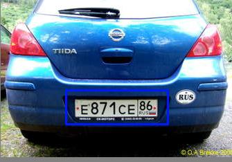

## car plate license detection
* Read the image
    * 
* Convert it into grayscale
    *  Gray scaling is common in all image processing steps.
    *   This speeds up other following process sine we no longer have to deal with the color details when processing an image.
* Import the [haarcascade files](https://github.com/opencv/opencv/tree/master/data/haarcascades)
* Then detect the multiscales.
 ``` python
 faces = faceCascade.detectMultiScale(gray,scaleFactor=1.2,minNeighbors = 5, minSize=(25,25))
 for (x,y,w,h) in faces:
    cv2.rectangle(gray,(x,y),(x+w,y+h),(255,0,0),2)
 ```
* It will give result of 4 corners.
* By using those corners we can draw a rectangular box around the plate differentiating it from baxkground.
 
 

### <i> when we input following picture: </i>


### <i> we will get following outputs: </i>


