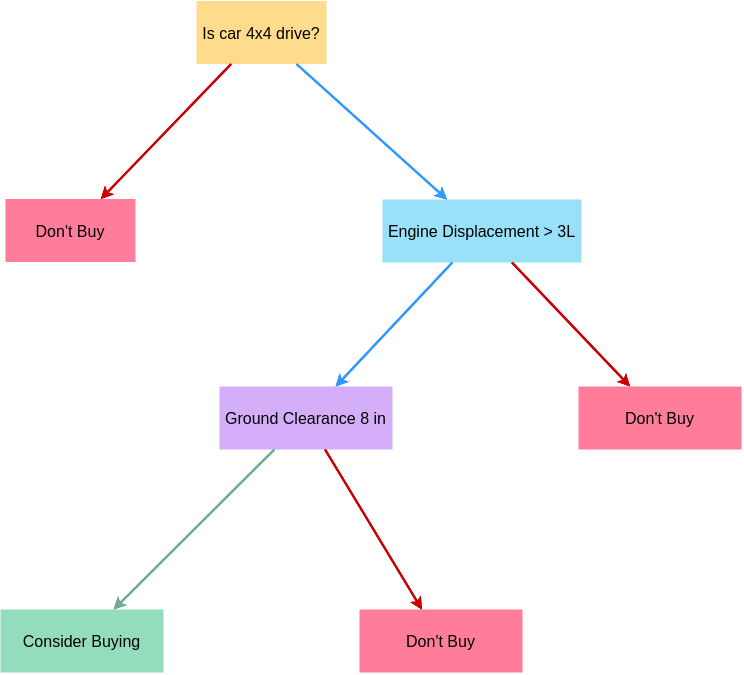
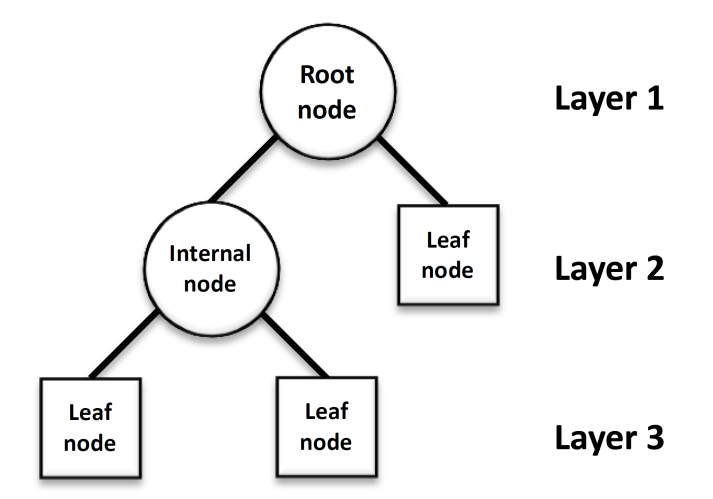
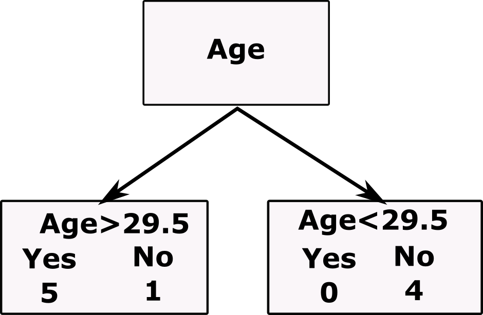
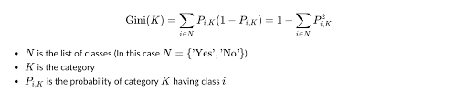
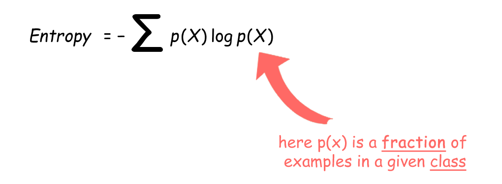
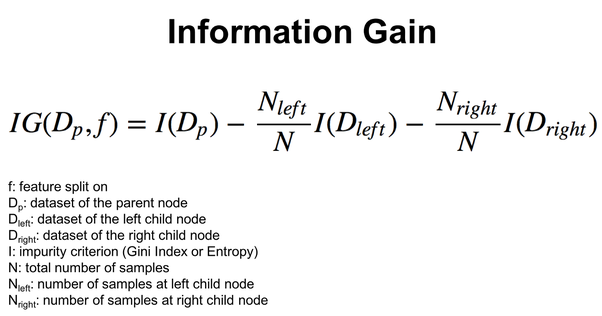
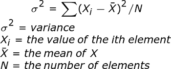

# Decision Tree Algorithm

Decision tree algorithm is commonly used for classification of data in a supervised manner i.e. a labelled dataset.The goal for this algorithm is to determine the class of a variable based on rules inferred from prior data.It chalks out a decision tree and classifies the test set values accordingly.

A decision tree is a diagram or chart that people use to determine a course of action or show a statistical probability. Each branch of the decision tree represents a possible decision, outcome, or reaction. The farthest branches on the tree represent the end results.

An example of a decision tree

Say we have to classify a dataset for a car company who wants to classify whether the customers will buy their SUV based on their personal information.This dataset has discrete values for classification.
| Age | Salary | Purchased |
| ----| ------ | --------- |
|25	|33000	|0|
|26|	80000	|0|
|26	|52000	|0|
|29|	80000	|0|
|30	|135000	|1|
| 32 | 150000 | 1 |
|35	|65000	|0|
|45	|26000	|1|
|46	|28000	|1|
|47	|25000	|1|

## Basic structure of a decision tree

# Decisiion tree for classification

The main challenge in this algorithm is to identify the conditions for classification.
# How to decide which condition should be present at what node?
## Gini impurity
Say we take average of ages between any 2 data points.The classification is as follows:

### Formula

#### Calculations
Here k is the age class

|Age|Probability of buying|Probability of not buying|Gini Impurity|
|----|-----|--------|-----|
|<29.5|0|1|0|
|>29.5|0.833|0.167|0.278|

Gini impurity of the internal node =0 x 4/10 +0.278 x 6/10 = 0.1699

We find the gini impurity for all the values of classifiable categories like age and salary and choose the minimum possible value for our internal node.

The internal node is again bifercated until *impurity of internal node<impurity of next connecting internal node*.
The next internal node is then considered to be the leaf node.
 
 ## What if the data is categorical?
 ## Information gain
 We follow a procedure similar to gini impurity and calculate the entropy and then the information gain.
 
 
 Lower the entropy,more is the purity of the node.
 
 
 
 Highter the information gain,more is the purity of the node.
 
 

This is used for categorical data.
 
 # Decision tree for regression
 We have the following data.We need to predict the salary for a particular level of position for example 4.5
 
 This data has continuous values,since the level and salary is proportional to the employee's level.
 |Position|	Level|	Salary|
 |-|-|-|
|Business Analyst	|1|	45000|
|Junior Consultant|	2|	50000|
|Senior Consultant|	3	|60000|
|Manager	|4	|80000|
|Country Manager	|5|	110000|
|Region Manager|	6	|150000|
|Partner	|7|	200000|
|Senior Partner|	8|	300000|
|C-level|	9|	500000|
|CEO	|10	|1000000|

##  How to so implement decision tree in this case?
### Reduction in Variance

We find the mean of data and calculate the variance of all the data points. The point with the minimum variance becomes the root node.
After we have split the data according to the condition,we again find the variance of the 2 different groups and find the next node.To prevent over-fitting ,we usually have a minimum number of data points that must in that node's category and you cannot split the node further.

## Happy Learning!

### **Sakshi Kulkarni**

**[sakbvb@gmail.com](mailto:sakvpms@gmail.com)**

