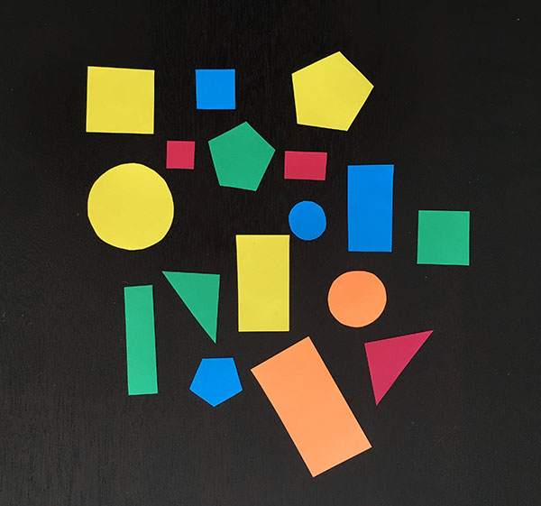

## Shape Detection

### Introduction:

Basically ***Shape Detection*** is nothing but **finding** different shapes in an image and **identifying** them. Using OpenCV, computers can be made able to detect shapes in an image by feeding them with some information and applying certain conditions and allow them to act based on the decision. This process involves *multi-steps*.

- *Installing* ***pip*** and ***imutils*** **packages**.
- *Importing* the necessary **libraries**.
- *Creating* the ***ShapeDetector*** **class**.
- *Loading* and *processing* the image and *finding* the contours.
- *Finding* the **center of each contour** and detecting the shape.
- *Displaying* the **output image**.

### Code Description:

Now, let's dive into the actual code of the topic. 

#### *Installing* ***pip*** and ***imutils*** **packages**:

The below-stated statements enable the user to *install* **pip** and **imutils** packages in the **conda environment**.

    conda install pip
    pip install imutils
    
#### *Importing* the necessary **libraries**:

Coming to the libraries that are used in this procedure, one needs to import **cv2** and **imutils**.

    import cv2
    import imutils
 
#### *Creating* the ***ShapeDetector*** **class**:

The tricky part of the code starts. Let's start coding!!!

To summarize the ***ShapeDetector*** class, it is a class that we define to *detect* the shape of a **Contour**. The **constructor** has no role to play since the object of thus class *doesn't* need any **initialization**. 

    class ShapeDetector:
        def __init__(self):
            pass
        
 The member function or the ***method*** **detect(self , c)** takes a contour as an argument, processes it to determine the shape of the contour. The shape of the contour is initially "unidentified". Then, the **perimeter** of the contour is calculated using the *cv2.arcLength()* function. Then, the contour is **approximated** using the *cv2.approxPolyDP()* function that takes the contour as the first argument and the second parameter is normally in the range of **1-5%** of the original perimeter of the contour. The approximation is based on the idea that a *series of short line segments* can approximate a **curve** and the resulting curve consists of a **subset of the originally defined points**. This *approximation* gives us the **number of vertices**.
 
        def detect(self , c):
            shape = "unidentified"
            peri = cv2.arcLength(c , True)
            approx = cv2.approxPolyDP(c , 0.04 * peri , True)
 
 Once the number of vertices are known, the shape identification process is easier and based on few *conditions*. The series of conditions include checking if the contour has *3 vertices or 4 or 5 or none*. *3* vertices represent that the shape is a *Triangle*; *4* vertices mean its a *Rectangle* or a *Square*; *5* means its a *Pentagon*; *none* inflicts the idea that it should be a *circle*. The *shape* of the contour is **returned**.
    
            if len(approx) == 3:
                shape = "Triangle"
            elif len(approx) == 4:
                (x , y , w , h) = cv2.boundingRect(approx)
                av = w / float(h)
                shape = "Square" if av >= 0.95 and av <= 1.05 else "Rectangle"
            elif len(approx) == 5:
                shape = "Pentagon"
            else:
                shape = "Circle"
            return shape

The idea behind determining if the shape is a square or a rectangle is that the **ratio** of the *width to the height* of a **square** is **approximately equal to 1**. An **approximated rectangle** is drawn around the contoural points using the *cv2.boundingRect()* function and then, the *ratio* of the width to the height is found out.  If the value of the *ratio falls around 1*, then the shape is a *Square*, else a *Rectangle*.

#### *Loading* and *processing* the image and *finding* the contours:

After the class definition is *done*, image **loading and processing** is required to utilize the function that is already defined. The image which contains different shapes is **read and loaded to a variable**. To ease the process of shape detection, the image needs a little processing to make the process of finding contours easier that makes a few steps. Fiest, the image is resized using the imutils.resize() function to enable *better approximation* of the contours. In future process, the factor by which the iamge is resized is of importance, because of which the ratio is found out and stored in a variable. 

    image = cv2.imread('extras/shapes_and_colors.jpg')
    resized = imutils.resize(image, width=300)
    ratio = image.shape[0] / float(resized.shape[0])
    
The resized image is then **converted** into **Grayscale** by using *cv2.cvtColor()* function. Then the Grayscaled image is **blurred** using *cv2.GaussianBlur()* function and at last **thresholded**. Thresholding is basically assigning the pixel values in relation to the threshold value provided where each pixel value is compared with the threshold value. This is done using the *cv2.threshold()* function. These are the basic processes involved before finding the contours of an image.

    gray = cv2.cvtColor(resized , cv2.COLOR_BGR2GRAY)
    blurred = cv2.GaussianBlur(gray , (5 , 5) , 0)
    thresh = cv2.threshold(blurred , 60 , 255 , cv2.THRESH_BINARY)[1]
 
After the image is ready, the thresholded copy is used to **find the contours** using the *cv2.findContours()* function and *imutils.grab_contours()* function. After this, an *object* for the ShapeDetector class is **created**.

    cnts = cv2.findContours(thresh.copy() , cv2.RETR_EXTERNAL , cv2.CHAIN_APPROX_SIMPLE)
    cnts = imutils.grab_contours(cnts)
    sd = ShapeDetector()

#### *Finding* the **center of each contour** and detecting the shape:

This phase needs the script to **iterate** through all the contours obtained. Each contour undergoes a series of statements, first one being the *finding of the **moments***. Image moment is a *weighted average* of the **image pixels' intensities**, usually chosen to have some *attractive property* or *interpretation*. Then, the *x* and *y* co-ordinates of the **center of the contour** is calculated. This basically is finding the **centroid** of the contour. The center is identified to enable **naming** the shape in the later part of the code.

    for c in cnts:
        M = cv2.moments(c)
        cX = int((M["m10"] / M["m00"]) * ratio)
        cY = int((M["m01"] / M["m00"]) * ratio)
        
Using the contour, the *shape* of the contour is obtained by calling **detect()** method defined in the **ShapeDetector** class on the object previously created. The contour value undergoes few changes like *conversion* to **float**, *multiplication* by the **ratio** to *find* the **actual position** of the respective contour in the *original image* and *conversion* to **int**.
        
        shape = sd.detect(c)
        c = c.astype("float")
        c *= ratio
        c = c.astype("int")
 
 Now, *draw* the **contour** of the shape on the ***original image*** and *name* the **shape**. This is just a 2 line code and uses simple functions like **cv2.drawContours()** and **cv2.putText()**.
        
        cv2.drawContours(image , [c] , -1 , (0 , 255 , 0) , 2)
        cv2.putText(image , shape , (cX , cY) , cv2.FONT_HERSHEY_SIMPLEX , 0.5 , (255 , 255 , 255) , 2)
    
#### *Displaying* the **output image**:

This is the *final* step for a contour that has been *drawn* and *named* with its shape in the **current loop**. The contour on the image that has been identified and marked is *displayed*. This uses the simple *cv2.imshow()* function.

        cv2.imshow("Image", image)
        cv2.waitKey(0)
        
This is the end of the code. 

Note:

- *Finding* the **center of each contour** and detecting the shape.
- *Displaying* the **output image**.

These are the *2 phases* that **repeat on loop** for the contours. These steps work for each contour in the contours' list and repeat until *all the contours* are **marked, identified and displayed** on the window. After all the shapes are detected and displayed, the user can close the window.

Consider the following *image*:

After detecting the shapes of all contours, the *output image* is: 

Written by: Sathyashree

Feel free to contact me on my [mailid](ksathyanrao@gmail.com). !!!
