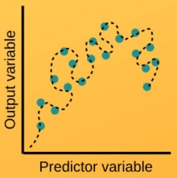
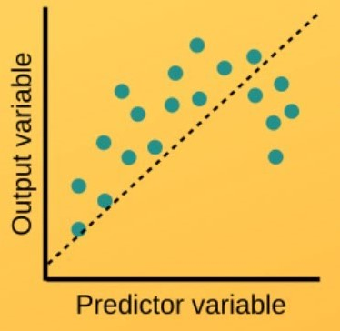
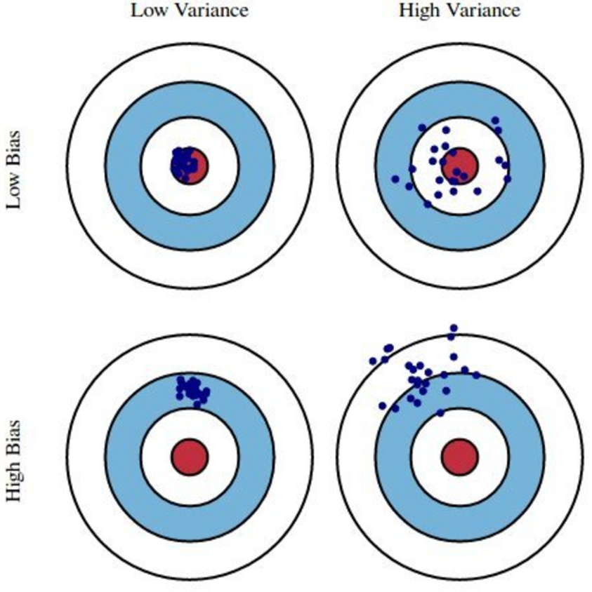

# Bias-Variance Tradeoff
## What is Bias & Variance :
### Variance : 
It is the tendency of algorithm to fluctuate very sensitively to fit highly flexible models and learning random things. High variance would cause an algorithm to model the noise in the training set. High variance is referred as **overfitting**.
 **Overfitting** is a modeling error that occurs when a function is too closely fit to a limited set of data points. Overfitting happens when a model learns the detail and noise in the training data to the extent that it negatively impacts the performance of the model on new data. This means that the noise or random fluctuations in the training data is picked up and learned as concepts by the model. The problem is that these concepts do not apply to new data and negatively impact the models ability to generalize.

### Bias : 
Bias is the algorithm’s tendency to consistently learn the wrong thing by not taking into account all the information in the data. Bias occurs when an algorithm has limited flexibility to learn the true signal from the dataset. A high bias means the prediction will be inaccurate. High bias is referred as **underfitting**.
 **Underfitting** refers to a model that can neither model the training data nor generalize to new data. An underfit machine learning model is not a suitable model and will be obvious as it will have poor performance on the training data.

## Tradeoff : 
* It is the case that, we can not minimize both bias and variance.
* So, we should look for a perfect balance of bias and variance.
## Major problem of Bias and variance is :
### Low Bias - High Variance :
It is known as the condition of overfitting. In this problem, we have a good result on training set, but not on cross-validation and test sets. If we take the result as average, we will have a great insight, but will be of no use.
### High Bias - Low Variance :
It is referred as the condition of underfitting. In this problem, we have bad result on each of training set, cross-validation set and test sets. The predictions will be similar to one another but on average, they are inaccurate.

## Reaching a Good Fit :
Ideally, you want to select a model at the sweet spot between underfitting and overfitting. To understand this goal, we can look at the performance of a machine learning algorithm over time as it is learning a training data. We can plot both the skill on the training data and the skill on a test dataset we have held back from the training process. Over time, as the algorithm learns, the error for the model on the training data goes down and so does the error on the test dataset. If we train for too long, the performance on the training dataset may continue to decrease because the model is overfitting and learning the irrelevant detail and noise in the training dataset. At the same time the error for the test set starts to rise again as the model’s ability to generalize decreases. The sweet spot is the point just before the error on the test dataset starts to increase where the model has good skill on both the training dataset and the unseen test dataset.
### To reduce Overfitting :
* You can get more training examples because a larger dataset is more probable to get a higher predictions.
* Try smaller sets of features, as it will decrease overfitting.
* Try increasing lambda, so you can not overfit the training set as much. The higher the lambda, the more the regularization applies.
### To reduce Underfitting :
* Try getting additional features, you are generalizing the datasets. More features means, more generalization.
* Try adding polynomial features, make the model more complicated.
* Try decreasing lambda, so you can try to fit the data better. The lower the lambda, the less the regularization applies.
## Summary :
We studied about the bias and variance, how high variance causes overfitting and high bias cause underfitting. We studied about the problems of overfitting and how we can trade off bias and variance to get the optimal results. We studied about the techniques to reduce the overfitting and underfitting.
