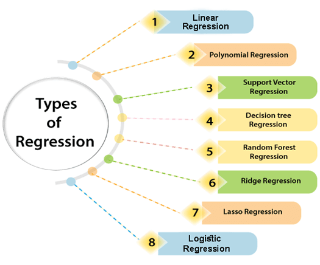
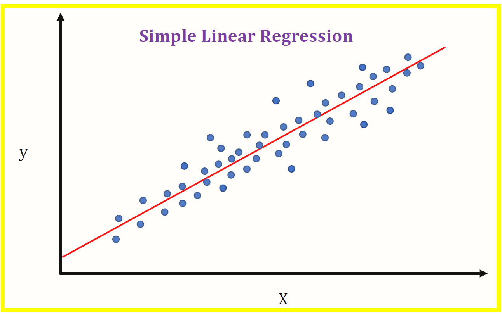
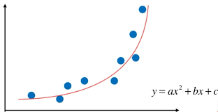
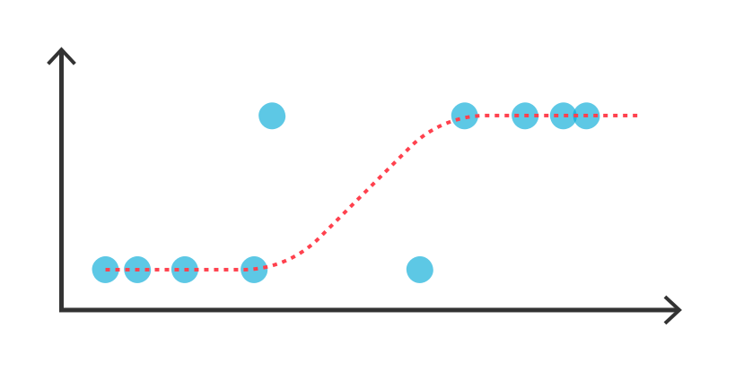

# Regression in Machine Learning 
Regression is a supervised learning technique which helps in finding the correlation between variables and enables us to predict the continuous output variable based on the one or more predictor variables.
## Regression is used for :
- Pediction 
- Forecasting 
- Time series modeling
- Determining the causal-effect relationship between variables.

## Types of Regression :
Few Major Type of Regression are:

- **Linear Regression :** 
 
    A few key points about Linear Regression are:
  - Fast and easy to model and is particularly useful when the relationship to be modeled is not extremely complex and if you don’t have a lot of data.
  - Very intuitive to understand and interpret.
  - Linear Regression is very sensitive to outliers.

- **Polynomial Regression :**

   A few key points about Polynomial Regression are:
   - Able to model non-linearly separable data; linear regression can’t do this. It is much more flexible in general and can model some fairly complex relationships.
   - Full control over the modelling of feature variables (which exponent to set).
   - Requires careful design. Need some knowledge of the data in order to select the best exponents.
   - Prone to over fitting if exponents are poorly selected.

- **Logistic Regression :**

   A few key points about Logistic Regression are:
   - Logistic regression is the appropriate regression analysis to conduct when the dependent variable is Binary.
   - Logistic regression is used to describe data and to explain the relationship between one dependent binary variable and one or more nominal, ordinal, interval or ratio-level independent variables.

These were few major types of regression.
