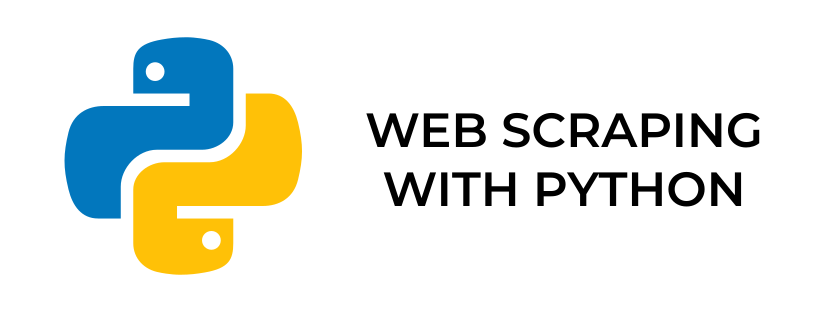

# Python Web Scraping

## 1. What is Web Scraping ?
Web scraping is the technique for extracting the relevant information from a webpage. web scraping allows user to get the relevant information from any websites and it can be done manually as well as with the help of bots as well.

## 2. Why Python for Web Scraping ?
Python has become one of the widely used programming language and with its easy to learn syntax and huge number of libraries such as BeautifulSoup, Scrapy , Pandas etc, it is one of the most preferred programming language for web scraping.

## 3. Things to know before getting started with Web Scraping
When starting web scraping keep these poits in mind :<br>
1 - Web Scraping might be against the terms of service of some websites so it is suggested that first contact the administrator before starting webscraping.

2 - Main step to start web scraping is to observe the webpage amd inspect the source code of the website thoroughly.

3 - You should have some basic knowledge of HTML and CSS before starting web scraping because you will mostly deal with HTML and CSS code so this step is mandatory.

<br>

# Getting Started

## Libraries Required

## 1. Requests
it is the library which is used to make HTTP requests from python program 


### Installation

Python 3 ```pip3 install requests``` \
Python 2.x ```pip install bs4```
## Methods for requests mode 
### get()
get function sends the get requests to the given url which then returns a response object<br>
### Example
``` python
import requests
source = requests.get(url)
```
```python
source.status_code
```

Output

```python
200
```

<br>


## 2. Beautifulsoup
BeautifulSoup is a python library used for parsing the HTML and XML data. We can iterated through all the data.
<br>You can read complete beautifulsoup documentation [here](https://www.crummy.com/software/BeautifulSoup/bs4/doc/)

Python 3 - ```pip3 install requests``` \
Python 2.x - ```pip install bs4```

### Using BeautifulSoup Library
### Example
``` python
import requests
import bs4
source = requests.get(url)
soup = bs4.BeautifulSoup(source.text,lxml)
```
## select ()

select() returns the list type object with the tag<br>

| Command | Description |
| --- | --- |
| select('tag') | tag is the name of any HTML tag |
| select('.class_name') | class name of the tag will always start with . |
| select('#id') | name of id of the tag will always start with # |
| select('tag1 tag2') | tag1 is the main tag while tag2 is the tag which is<br>enclosed within the main tag |
| select('tag1 > tag2') | tag1 is the main tag while tag2 is the directly<br> enclosed within the main tag |

<br>

1 - Using select() to grab the title of the webpage
```python
title = soup.select('title')
```

2 - Using select() to grab the data from a specific tag
```python
tag = soup.select("div")
```
3 - Using Select() to get the data from an attribute of a tag
```python
tag = soup.select("img")
tag["src"]
```
4- Using select() to get data from the tag with specific id
``` python
# id will always start with #
id_data = soup.select("#id")
```

4- Using select() to get data from the tag with specific class
``` python
# class will always start with .
id_data = soup.select(".class")
```

<br>

### Created by Swapnil Rawat<br>
### Contact me at 
### [Instagram](https://www.instagram.com/swapnil_r17/) 
### [Twitter](https://twitter.com/XavierGreek) 
### [Github](https://github.com/swapnilr17) <center>