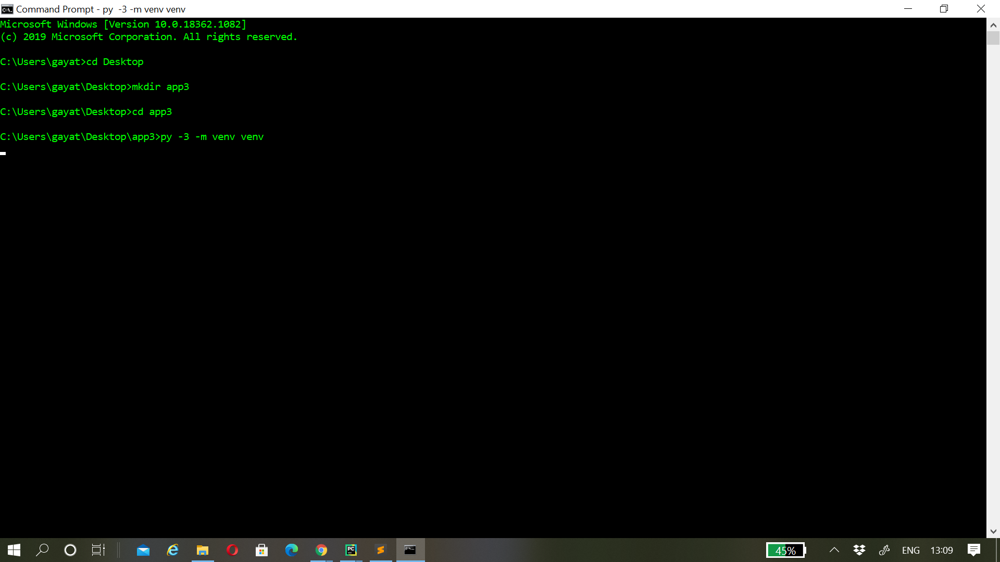
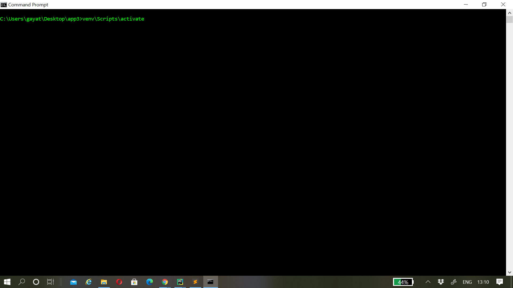
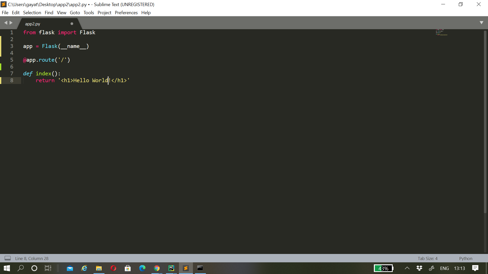
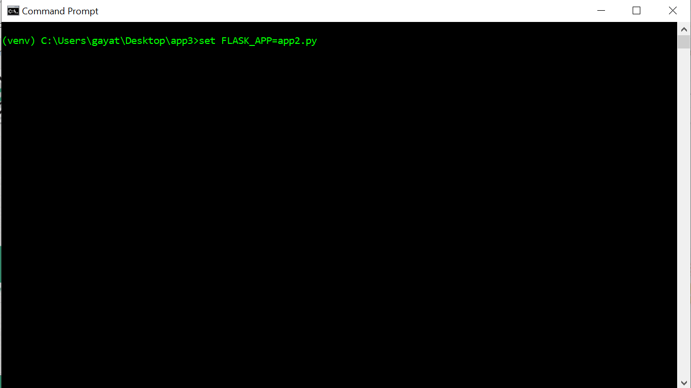
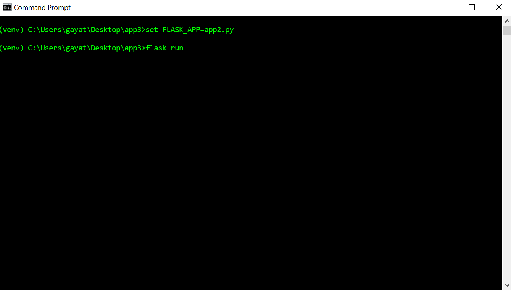
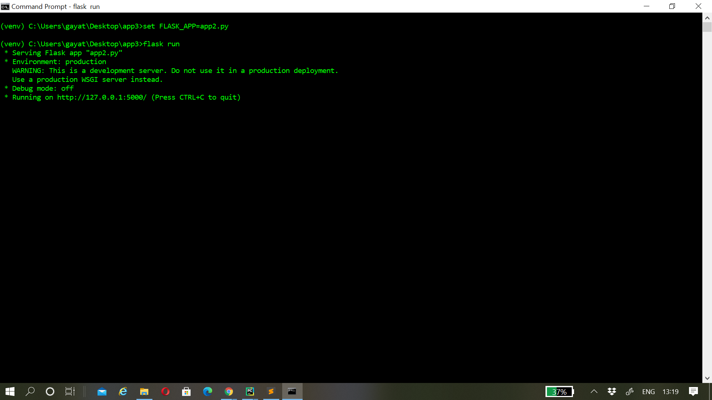
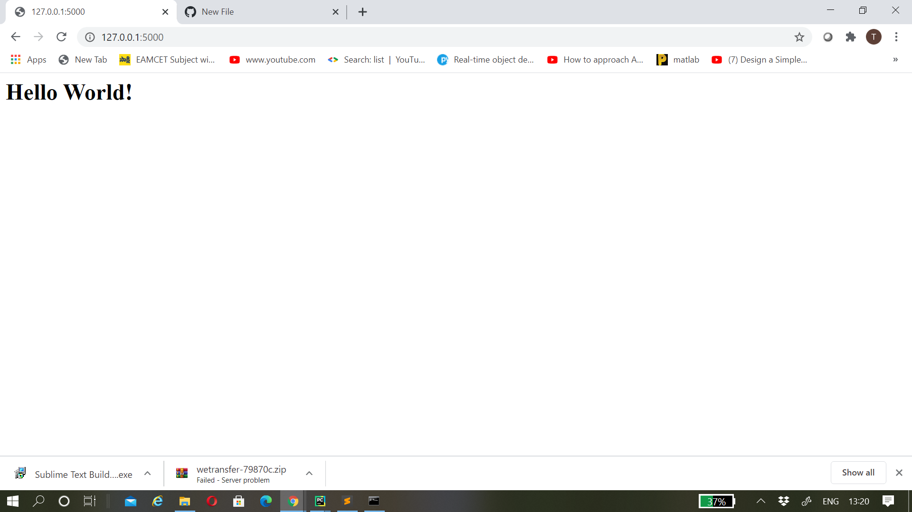

<h2> Flask</h2>

 Flask is a web application framework written in Python. A web framework is a collection of modules and packeges which facilitates or supports the user to create dynamic web applications.
It facilitates creation,development and publishing of web applications. Flask is based on the Werkzeug WSGI toolkit and Jinja2 template engine.It includes a built-in development server, unit tesing support, and is fully Unicode-enabled with RESTful request dispatching and WSGI compliance.

<h3> WSGI(Web Server Gateway Interface)</h3>

 Web Server Gateway Interface is a simple calling convention for web servers to forward requests to web applications or frameworks written in the Python programming language.
 It acts as an interface between web servers and web applications.

 <h3>Jinja2</h3>
 
Jinja2 is a template engine written in pure Python. It combines a template with a certain data source to render dynamic web pages.

 <h3> Prerequisites for the better understanding of Flask</h3>
 <ul><li>HTML</li><li>Python</li></ul>
 <h3> Installation of Flask</h3>
 
 Now lets look at the installation of flask and execution of a basic Application <i>"Hello world"</i>
 
 <ul><li><h2>Step 1:</h2><h3> Installation of latest version of Python in the local computer</h3> 
 
 Make sure to install the  latest  version of python in the system using the following link: <a href="https://www.python.org/downloads/windows/">Python download</a>

 
 <li><h2>Step 2:</h2><h3>Creation of a directory and virtual environment</h3>
 
 Python Virtual environment is used to create an isolated environment for Python projects. A project can have its own dependencies, regardless of what 
 dependencies every other project has. Type the following command in the windows command prompt to create a new directory and virtual environment. 
 
   
  <i>The above command "py -3 -m venv venv " is for virtual environment creation</i> 
 
 <li><h2>Step 3:</h2><h3> Activation</h3>
   
 Now type the following command in the command prompt to activate the virtual environment.
 
    
 
  <li><h2>Step 4:</h2><h3> Install flask</h3> 
   
 After activation you could notice "(venv)" on the left side implying the creation of environment and now type the following command to install flask"
 
   
  
  
   <li><h2>Step 5:</h2><h3>Creation of the application using a text editor</h3>
    
 Now use a text editor and create a <i>".py"</i> file and save it in the same directory created previously i.e "app3"
 
  
 
   <li><h2>Step 6:</h2><h3>Set FLASK_APP and run the flask</h3>
 
 To get the output type the following commands

  
  
 
 <li><h2>Step 7:</h2><h3>Output</h3>
 
 After running the above command copy the address provided by the prompt after successful execution of the application and paste it in the browser, click enter to see the output.

 
 
     
 
 
 
    
   
 
 
 
