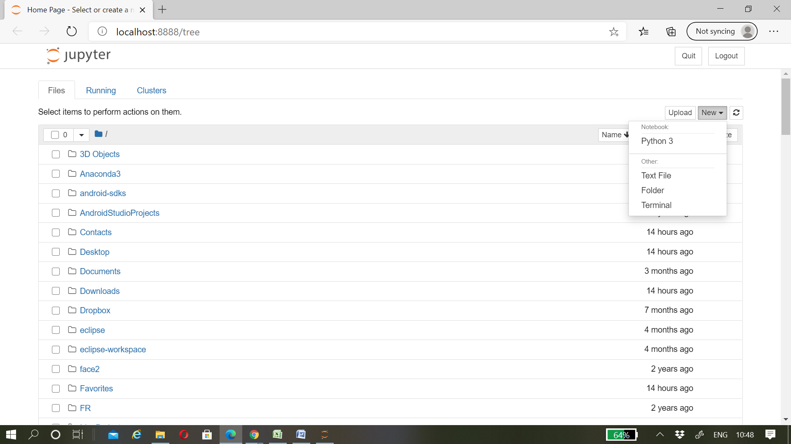

<h1>Jupyter Notebook</h1>

Jupyter notebook is an interactive and powerful tool to create the realtime projects like datascience projects. 
It is an open source web application. It is used widely to create the documents that contain live codes,text,graphs/visualization.Jupyter notebook combines the output and code in a single file i.e, a user can type the code,run it and see the otput. Jupyter notebook is not built-in or included in python,it has to be installed.

<h2> Installation</h2>
Jupyter notebook can be installed in the following two ways: 
<ul><li>Download Anaconda</li><li>Using pip of python</li></ul>
<ol><li>Download Anaconda: 

Anaconda integrates many of the tools used in data science and machine learning with just one install. It is widely used for creating data science and other real-time projects.
It includes many python libraries which include numpy,pandas,matplotlib,Jupyter,etc.
</li>
<li>Using pip: 

 Using python tool pip, type the following command in the terminal.
 
<i> pip install jupyter</i>
<h2>Creating a notebook</h2>

 Now the first task is to get familiar with the notebook interface and creating the first notebok file. Run the jupyter using Anaconda shortcut found on the start menu or desktop
which will open a newtab as shown below
 

 It is not the jupyter notebook, its just a launchpad for editing and creating the notebooks. The url of the dashboard should look like this: <i>http://localhost:8888/tree</i>.
Now click on the new button on the top right corner, it will open up a dropbox or a list of options. Select python 3 or python 2. Then the webpage should look like this.

 

 Now at the top of the page, you could see <i> Untitiled</i> on the left corner of the file i.e the notebook is not labeled yet. The extension of Jupyter notebook is .ipynb.  

  

Just click on the "Untitled". It pops up a dialog box asking to rename notebook. We can rename with name we want to title the file.

<h2>Getting familiar with the interface and terminology</h2>

The two terms to get familiar with are: 
<ol><li>Cells: Cell is an input ccontainer for the code to be executed and to display the text in the notebook.</li>
<li>Kernel: Kernel is a computational engine that executes the code in a notebook document. It computes the code in the file</li></ol>

Cells are of four types: 
<b>Code cells</b> contain the code to be executed. 
<b>Markdown cells</b> contain text which should not be considered as a code in the document. It displays the text which can be formatted using markdown language. A normal cell can be converted into markdown cell from cell menu on the top. Example pics of markdown and normal cell. 

<h2>How to run the cells</h2>

Initially the Jupyter notebook will have only a single cell. A user can give his code in the first cell and check whether everything is working fine or not. To run a particular cell, click on the cell type in the code and click on the <i>Run</i> to execute the cell code.

<h3>Example:</h3>
<i>print('Hello world, this is jupyter')</i> 

Multiple cells in the code helps the user to fragment the code and check its execution seperately. You could notice that on the left side a square bracket after the word <i>In</i>.The square braces will auto fill with a number that indicates the order that you ran the cells. If you run the cell for the first time, the square bracket will be filled with 1. If you run the same cell again it changes to 2 as shown below.
 
  
 
  
<h2>Menu bars on the top of the File</h2>
<ol><li>File:
 In the file menu you can create a new notebook file, open an existing file, save the new file created, make a copy, and the other important feature is Save and Checkpoint. You can set a checkpoint so that you could roll back to that point.
</li>
  <li>Edit:
 In the edit menu you can <i>cut</i>,<i>copy</i>,<i>paste</i> or <i>delete</i> the cells. You can also split,merge or move cells up and down and many more.
</li>
  <li>View:
 The View menu is useful for toggling the visibility of the header and toolbar.
</li>
  <li>Insert:
 The Insert menu is useful to insert the cells above and below.
</li>
   <li>Cells:
 The Cells menu is useful to run a particular cell, run all the cells, run all the above cells of a particular cell,run all the cells below a particular cell.A user can also select the cell type i.e Code, Markdown and Raw NBConvert
</li>
  <li>Kernel:
 The Kernel menu is for working with the kernel.You can interrupt,restart the kernel, reconnect to it, shut it down, or even change the kernel.
</li>
  <li>Widget:
 The widget menu provides the options to <i>save the notebook widget state</i>, <i>clear the notebook widget state</i> and also to <i> Download the widget state</i>
</li>
  <li>Help</li></ol>
  
  
  <h2>Markdown cell</h2>

Jupyter Notebook supports Markdown, which is a markup language that is a superset of HTML. It is easy to learn if the user has a basic knowledge of HTML.
  Select the Markdown in the cell menu and type the text you wanted to project and click on run, the output should look like this.

  
  
  
  <h2>Header</h2>
  Headers can be created in the mark down cells using <i>"#"</i> symbol. As the number of "#" symbols increases the header size decreases. Look at the example shown below. 
  
  
  
  <h2> Creating lists</h2>
  A list can be created using dashes, plus signs, or asterisks. Look at the example below.
  <h3>Example</h3>
   
   
   
  
  
  
  
  
  
  
  

 
 

