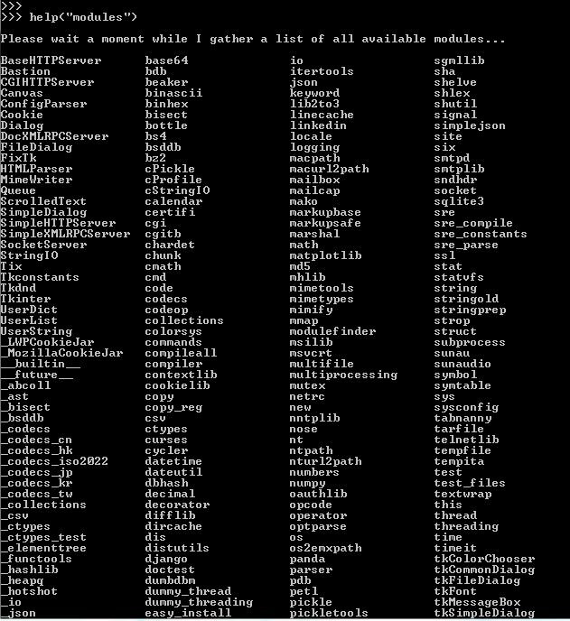

<h1>Modules in Python</h1>

Module can be termed as a file containing a set of functions,classesor variables. Grouping related code into a module
makes it easy to keep a track of the code. 

In real time scenarios,It is really a tedious task to write the complete code of a project in a single file.
Therefore, the project can be fragmented into various modules, which facilitates the user to keep track of the code
and eases the task to correct the errors if any.

<h2>Built-in Modules</h2>

 Modules which are already a part of python programming language and can be readily imported into python files are 
known as Built-in modules.

<h3>Examples:</h3>&nbsp; <i> Platform,OS,SYS,RANDOM,etc.  
<ul><li>OS: OS module is a python module that helps us to perform many operating system related tasks. The OS module in Python provides functions
for creating, removing a directory (folder), fetching its contents, changing and identifying the current directory, etc.</li>
<h4>Example</h4>
Import OS 
os.mkdir(‘C:\\Users\\gayat\\Desktop\\module’) 
os.rmdir(‘C:\\Users\\gayat\\Desktop\\module’’)  
<i>This will create a directory named module on desktop</i>  

<li>Statistics: The statistics module provides us the functions to handle statistics of numeric data. These functions include: 
<ul><li>Mean()</li><li>Median()</li><li>Mode()</li><li>stdev()</li></ul></li></ul>
<h4>Example</h4>

import statistics as st 
List1=[1,2,3,4,5,6,6,3,2,4] 
print(st.mean(list1)) 
print(st.median(list1)) 
print(st.mode(list1)) 
print(st.stdev(list1))

<h5>Output:</h5>&nbsp;&nbsp;&nbsp;&nbsp;&nbsp;&nbsp;&nbsp;&nbsp;3.9 
&nbsp;&nbsp;&nbsp;&nbsp;&nbsp;&nbsp;&nbsp;&nbsp;4.0 
&nbsp;&nbsp;&nbsp;&nbsp;&nbsp;&nbsp;&nbsp;&nbsp;6 
&nbsp;&nbsp;&nbsp;&nbsp;&nbsp;&nbsp;&nbsp;&nbsp;1.8529256146249728 

                      
                      

<h2>Creating a Module</h2>

A module can be created by saving the code you want in a file with .py extension. Any name can be given to the module.

<h3>Example</h3>
<table><tr><th>goodmorning.py</th></tr><tr><td>def goodmorningmsg(name): 
&nbsp;&nbsp;print("Good Morning,"+name)</td></tr></table> 

Use a keyword <i>"import"</i> to import the module into the current workspace.

<table><tr><th>mainmod.py</th></tr><tr><td>import goodmorning 
goodmorning.goodmorningmsg("John")</td></tr></table> 
<h5>Output:</h5>&nbsp;Good Morning,John 
<h2>Alias name or re-naming a module</h2>

It is used to create an alias name for the module.

<h3>Example</h3>
<table><tr><th>mainmod1.py</th></tr><tr><td>import goodmorning as gm 
a=gm.goodmorningmsg("John") 
  print(a)</td></tr></table>

<table><tr><th>goodmorning.py</th></tr><tr><td>def goodmorningmsg(name): 
&nbsp;&nbsp;print("Good Morning,"+name)</td></tr></table> 

<h5>Output:</h5>&nbsp;Good Morning,John 

<h2>from import Statement</h2>

The "from module import function" statement is used to import a specific function from a Python module. Instead of importing the complete module ,the user could import only the necessary function. 
<table><tr><th>Syntax</th></tr><tr><td>from modulename import name1[,name2[,name3..]]</td></tr></table> 
<h3>Example</h3>
<table><tr><th>greetings.py</th></tr><tr><td>def greetings(name): 
&nbsp;&nbsp;print("Hello How are you?," +name) student1={"name":John,"age":20,"id":33}</td></tr></table> 
<table><tr><th>mainmod2.py</th></tr><tr><td>from greetings import student1  
print(student["id"])</td></tr></table> 
<h5>Output:</h5>33 
<h2>To display a list of available modules</h2>

Type the following command in the python module.
 
<i>>>>help('modules')</i>
<h5>Output</h5> 

<h2>You can find the execution of the above examples in the following files</h2>
<ul><li>j</li></ul>
